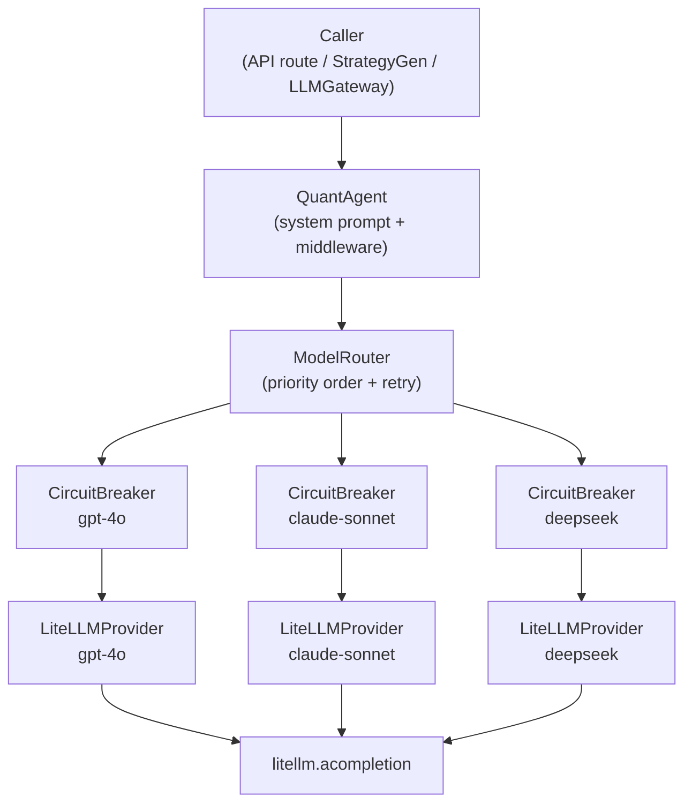

# LLM Agent Layer — Architecture Design

## Overview

All LLM calls in QuantPilot route through `QuantAgent` (`quantpilot.agent`).
The agent layer provides multi-model fallback, per-model circuit breaker,
exponential-backoff retry, and a middleware hook system.

## Architecture



## Components

### `QuantAgent`

- Entry point for all callers
- Injects system prompt (`SYSTEM_PROMPT`) as the first message
- Runs `Middleware` chain: `before_request` → router → `after_response`
- On error: calls `on_error` hooks, then re-raises (or yields `[错误]` token for streams)

### `ModelRouter`

- Sorts models by `priority` (ascending); lower = tried first
- Per model: up to `max_retries` attempts, backoff = `min(base * 2^(attempt-1), max_delay)`
- In HALF_OPEN state: only 1 probe attempt allowed
- After all retries fail: calls `CircuitBreaker.record_failure()`
- Falls back to next model; raises `AllModelsFailedError` if all exhausted
- **Note:** `stream()` does not retry per model — first-token failure triggers immediate fallback

### `CircuitBreaker` (per model)

| State | Meaning | Transitions |
|---|---|---|
| CLOSED | Normal | → OPEN when failures ≥ threshold |
| OPEN | Blocked | → HALF_OPEN after recovery_seconds |
| HALF_OPEN | Probing | → CLOSED on success, → OPEN on failure |

Caller (ModelRouter) is responsible for serializing probes in HALF_OPEN state.

### `LiteLLMProvider`

- Thin `litellm.acompletion` wrapper for one model
- No retry logic; retry is in `ModelRouter`
- `stream()` returns an `AsyncIterator[str]`; router peeks first token before committing

### `Middleware` (Protocol)

```python
class Middleware(Protocol):
    async def before_request(self, messages, context) -> None: ...
    async def after_response(self, response: str, context) -> str: ...
    async def on_error(self, error: Exception, context) -> None: ...
```

Built-in: `LoggingMiddleware` — logs request size and response latency.

Custom middleware examples:
- **RAG**: in `before_request`, retrieve relevant docs and inject into messages
- **Token tracking**: in `after_response`, count tokens and write to metrics DB
- **Auth**: in `before_request`, verify caller has LLM quota

### Config (`backend/config/llm_agents.toml`)

```toml
[agent]
retry_base_delay = 0.5
circuit_breaker_threshold = 5

[[models]]
id = "gpt-4o"
priority = 1
```

`AgentConfig.from_toml(path)` merges `[agent]` defaults into each `[[models]]` entry.

## Extension Points (stub protocols)

These are not implemented but the architecture reserves space:

- **RAG**: `before_request` middleware fetches relevant chunks via embeddings and injects into messages
- **Tool Calling**: stays in `LLMGateway.chat(use_tools=True)` — requires pinned model for `tool_call_id` continuity
- **Memory**: `after_response` middleware persists conversation summaries; `before_request` injects them

## Backwards Compatibility

- `LLMGateway.chat(use_tools=False)` delegates to `QuantAgent.chat()`
- `LLMGateway.stream()` delegates to `QuantAgent.stream()`
- `LLMGateway.chat(use_tools=True)` keeps existing litellm tool-calling logic (pinned model)
- `StrategyGenerator.generate()` delegates to `QuantAgent.chat()`
- All existing tests pass unchanged

## Fallback Flow Example

```
Request → gpt-4o (attempt 1: rate limited, attempt 2: rate limited, attempt 3: rate limited)
       → gpt-4o circuit opens
       → claude-sonnet (attempt 1: success) ✓
```
