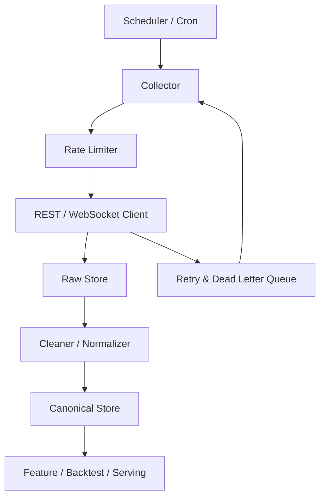

# 模块 3：数据工程

> 量化系统的第一生产力不是模型，而是数据管道；没有稳定、可信、可回放的数据，回测、训练和实盘都会建立在沙地上。

## 前置知识

- 建议先完成 [金融市场基础](./01_financial_market_basics.md)
- 建议完成 [量化交易核心概念](./02_quant_trading_core_concepts.md)

## 学习目标

学完本模块你将能够：

1. 根据市场、频率和预算为美股与加密市场选择合适的数据源。
2. 设计 REST 轮询和 WebSocket 推送两类数据采集方案。
3. 为历史回测、实时行情、订单记录选择合理的存储方案。
4. 掌握复权、缺失值、异常值、时间对齐等关键清洗步骤。
5. 对另类数据的引入边界有清醒认识，避免“为了显得高级而加数据”。

## 正文内容

### 3.1 为什么数据工程在量化里是核心模块

很多初学者对“量化”的想象是：  
模型 + 指标 + 策略。

但实际系统里，最先把你绊倒的常常不是模型，而是：

- 数据下载不稳定
- 时间戳不一致
- 美股有拆股分红而你没复权
- 加密行情丢点
- WebSocket 断线后没有补数
- 历史回测和实盘使用了完全不同的数据口径

在工程语言里，数据工程的职责可以概括为：

1. **拿到正确数据**
2. **让它可用**
3. **让它可追溯**
4. **让研究环境和执行环境尽量共享同一套事实来源**

### 3.2 数据源选型

> 数据源的“最优解”不存在，只有在预算、频率、覆盖范围和稳定性之间的折中。下面的表格更适合作为选型起点，而不是一次性拍板结果。

#### 3.2.1 美股数据源对比

| 数据源 | 免费额度 | 数据类型 | 延迟 | API 质量 | 适合场景 |
|---|---|---|---|---|---|
| Yahoo Finance / `yfinance` | 免费，偏个人研究用途 | 日线、分钟线、部分基础面、新闻 | 非官方聚合，时延和稳定性因接口而异 | 上手快，但协议和稳定性不适合生产 | 原型验证、教学、个人研究 |
| Polygon.io | 有免费层；当前官方免费股票档位约为 5 req/min、约 2 年历史和 EOD/分钟聚合能力 | 股票、期权、企业行为、快照、WebSocket | 免费层偏延迟或受限；付费层更强 | 很强，文档清晰，开发者体验好 | 需要更正规研究/服务化接入 |
| Alpaca Market Data | 有免费层；官方公开免费层含美股、期权指示价、加密数据与 WebSocket 限制 | 股票、期权、加密、订单簿（部分） | 免费股市数据以 IEX 范围为主，近实时受订阅约束 | 很好，与交易 API 配套 | 想同时做美股数据与交易接入 |
| IEX Cloud | 历史上有免费层，但原服务已于 **2024-08-31** 退场 | 历史案例意义大于新项目价值 | 已不适合作新项目主选 | 仅适合作为历史教程背景 | 迁移旧系统、理解旧文档 |
| Alpha Vantage | 有免费 API Key；许多高级与实时接口为 Premium | 日线/分钟线、FX、Crypto、技术指标、宏观数据 | 免费层更多是日终或延迟 | 接口覆盖广，但商业与实时能力多在付费层 | 快速试验、轻量研究、教学 |

#### 3.2.2 加密货币数据源对比

| 数据源 | 免费额度 | 数据类型 | 交易所覆盖 | 适合场景 |
|---|---|---|---|---|
| Binance API | 公共市场数据接口免费，受 request weight 限制 | K 线、成交、订单簿、资金费率、合约数据 | Binance 生态内部最全 | 做 Binance 研究、执行、回测一致性要求高 |
| OKX API | 公共接口免费，按 endpoint 有不同限频 | 现货、永续、期权、账户、订单 | OKX 自身市场 | 做 OKX 现货/合约/多品类研究 |
| CCXT | 开源库本身免费；真实限频取决于目标交易所 | 统一封装 OHLCV、订单簿、交易、账户接口 | 覆盖 100+ 交易所 | 一套代码接多所、做跨所研究 |
| CoinGecko | Demo 层可用，官方文档给出公共/演示层大约每分钟约 30 次请求 | 价格、币种元数据、板块、市值等聚合信息 | 聚合型，不是执行级交易所源 | 行情看板、宏观视角、资产发现 |
| CryptoCompare | 有免费层，高级历史与机构能力付费 | 聚合行情、历史数据、指标 | 覆盖广，偏聚合 | 市场概览、多源对比、研究用途 |

#### 3.2.3 选型建议

- **入门原型**：美股用 `yfinance`，加密用 Binance 或 CCXT。
- **研究升级**：美股转 Polygon / Alpaca，合约和多交易所研究继续用 CCXT + 直连交易所补差异。
- **实盘准备**：行情源尽量靠近真实执行源，避免研究和执行看到的是两种市场。

一个很实用的原则：

> 如果你准备在哪家券商/交易所交易，就优先验证它自己的行情/交易 API 能不能满足核心需求。

否则你很容易在研究阶段用 A 数据源，在执行阶段用 B 数据源，最后因为时区、复权、扩展时段、盘口口径不一致而出现“回测不认识实盘”的问题。

### 3.3 数据采集方案

#### 3.3.1 REST 轮询 vs WebSocket 实时推送

| 方案 | 优点 | 缺点 | 适合场景 |
|---|---|---|---|
| REST 轮询 | 简单、易调试、容错好、重放容易 | 时效性一般，请求开销大 | 历史数据、低频更新、补数 |
| WebSocket 推送 | 延迟低、适合实时系统 | 断线恢复复杂、状态维护复杂 | 实时行情、盘口、订单状态 |

经验上可以这样搭：

- **历史回测仓库**：REST 拉全量 / 增量
- **盘中实时行情**：WebSocket
- **断线补数**：WebSocket + REST 补洞

#### 3.3.2 增量采集 vs 全量采集

##### 全量采集

每次从头下载完整历史。  
优点是简单，缺点是浪费资源。

适合：

- 原型阶段
- 数据量不大
- 数据源更新频率很低

##### 增量采集

只拉上次成功时间点之后的新数据。

适合：

- 生产环境
- 高频更新
- 数据量大

增量采集必须解决三个问题：

1. **上次同步点如何记录**
2. **重复数据如何去重**
3. **失败后如何重跑而不丢数据**

这和日志消费、CDC、增量 ETL 的思路很像。

#### 3.3.3 频率限制（Rate Limit）处理策略

当你把交易所 API 当作无限吞吐的内网服务来用时，很快就会被教做人。常见策略包括：

- 本地令牌桶 / 漏桶限流
- 指数退避重试
- 分 symbol 分时间窗口调度
- 批量接口优先于单条接口
- 缓存短周期重复请求

对于多交易所接入，建议抽象一个统一的限频器接口，按“提供方 + endpoint + 凭证”维度独立控制。

#### 3.3.4 完整采集脚本架构设计



推荐把采集链拆成三层：

1. **Raw Store**：原始响应，尽量少加工，便于追溯
2. **Canonical Store**：统一字段、统一时区、统一 symbol 规范
3. **Serving Layer**：给回测、特征工程、执行系统使用的面向查询视图

#### 3.3.5 一个最小采集器的职责拆分

```python
from __future__ import annotations

from dataclasses import dataclass
from datetime import datetime
from typing import Protocol


@dataclass
class FetchJob:
    provider: str
    symbol: str
    timeframe: str
    start: datetime
    end: datetime


class MarketDataClient(Protocol):
    def fetch_ohlcv(self, symbol: str, timeframe: str, start: datetime, end: datetime) -> list[dict]:
        """Fetch normalized OHLCV records from a remote provider."""


class RawStore(Protocol):
    def write(self, provider: str, payload: list[dict]) -> None:
        """Persist raw provider payload for replay and debugging."""


class CanonicalStore(Protocol):
    def upsert_ohlcv(self, records: list[dict]) -> None:
        """Store deduplicated, normalized OHLCV records."""


def run_fetch_job(job: FetchJob, client: MarketDataClient, raw_store: RawStore, store: CanonicalStore) -> None:
    payload = client.fetch_ohlcv(job.symbol, job.timeframe, job.start, job.end)
    raw_store.write(job.provider, payload)
    normalized = [
        {
            "provider": job.provider,
            "symbol": job.symbol,
            "timeframe": job.timeframe,
            "ts": row["ts"],
            "open": float(row["open"]),
            "high": float(row["high"]),
            "low": float(row["low"]),
            "close": float(row["close"]),
            "volume": float(row["volume"]),
        }
        for row in payload
    ]
    store.upsert_ohlcv(normalized)
```

这段代码不复杂，但体现了核心思想：  
**采集、原始保存、标准化、入库要拆开。**

### 3.4 数据存储选型

#### 3.4.1 一个简单决策树

```text
是实时高频查询吗？
├─ 是 -> 需要时序/流式写入能力：TimescaleDB / InfluxDB / Kafka + 下游存储
└─ 否
   ├─ 是历史回测批量扫描吗？ -> Parquet / DuckDB
   ├─ 是交易记录、账户、元数据吗？ -> PostgreSQL
   └─ 是原始响应归档吗？ -> 压缩 JSON / Parquet / Object Storage
```

#### 3.4.2 时序数据库

**InfluxDB / TimescaleDB** 适合：

- 实时行情写入
- 按时间窗口查询
- 监控指标

但要注意：

- 时序库不一定是回测扫描最舒服的格式
- 超大量历史回放未必比 Parquet + DuckDB 更划算

#### 3.4.3 关系型数据库

**PostgreSQL** 适合：

- 账户
- 订单
- 成交
- 策略配置
- 元数据

因为这些数据天然是事务型、关系型、需要约束的。

#### 3.4.4 文件存储

**Parquet / HDF5** 适合：

- 大批量历史行情
- 特征数据集
- 回测输入

Parquet 的优势尤其明显：

- 列式压缩
- 扫描快
- 适合和 pandas / polars / DuckDB 配合

#### 3.4.5 存储方案对比

| 方案 | 写入速度 | 查询速度 | 存储效率 | 运维难度 | 典型用途 |
|---|---|---|---|---|---|
| PostgreSQL | 中 | 中 | 中 | 中 | 元数据、订单、策略配置 |
| TimescaleDB | 中高 | 高 | 中 | 中高 | 实时行情与时间窗口查询 |
| InfluxDB | 高 | 高 | 中 | 中高 | 指标监控、时序写入 |
| Parquet | 批量高 | 扫描高 | 高 | 低 | 历史回测、离线研究 |
| DuckDB | 本地分析高 | 高 | 中高 | 低 | 单机研究、回测聚合 |

### 3.5 数据清洗

#### 3.5.1 复权处理

在美股中，股票可能分红、拆股。  
如果你不做复权，就会看到一根“凭空暴跌”的 K 线，回测指标会被污染。

- **前复权**：把历史价格向当前价格体系调整，适合看连续走势
- **后复权**：把当前价格向历史价格体系调整，适合看原始持有收益路径

为什么回测必须重视复权？

因为策略看到的是价格序列。  
如果价格序列因为拆股而突然腰斩，但你却把它当成真实暴跌，策略和指标都会被误导。

#### 3.5.2 缺失值处理

常见策略：

- 前向填充（Forward Fill）
- 插值（Interpolation）
- 删除（Drop）
- 标记缺失（Add Missing Flag）

选择原则：

- 价格序列中，非交易时段空洞不能简单填成“价格不变”
- 低频宏观指标可前向填充到高频
- 缺失本身有信息时，不要直接抹掉

#### 3.5.3 异常值检测

##### 3σ 原则

如果某个值偏离均值超过 3 倍标准差，可以视为异常候选。

$$|x - \mu| > 3\sigma$$

##### MAD（Median Absolute Deviation）

对极端值更鲁棒：

$$MAD = median(|x_i - median(x)|)$$

适合金融数据，因为金融数据本来就厚尾、容易出现极端跳动。

#### 3.5.4 数据对齐

真实系统里最常见的问题之一就是“同一时刻”根本不统一：

- 美股常用美国东部时间
- 加密常用 UTC
- 宏观数据可能是发布日期，不是生效时刻
- 新闻有发布时间和被你拉到的时间

对齐原则：

1. 内部统一存 UTC
2. 展示层再做本地时区转换
3. 高频与低频对齐时，明确使用左对齐、右对齐还是向前填充
4. 不要让未来发布日期提前泄露给过去样本

### 3.6 另类数据

#### 3.6.1 链上数据

典型来源：

- Glassnode
- Dune Analytics

能获取的信息包括：

- 活跃地址数
- 交易所净流入净流出
- 长短期持有人行为
- 稳定币供应变化

适合：

- 中低频加密因子研究
- 风险偏好与链上行为分析

#### 3.6.2 社交情绪数据

常见来源：

- X / Twitter
- Reddit
- Telegram / Discord（更难结构化）

一个最小 NLP pipeline 通常包括：

1. 抓取文本
2. 去重去噪
3. 语言识别
4. 情感打分
5. 时间对齐
6. 聚合成按分钟/小时/天的情绪因子

#### 3.6.3 新闻因子

新闻数据常用于事件驱动策略，例如：

- 财报
- 并购
- 监管处罚
- 宏观政策

但新闻因子最难的一点不是抓数据，而是：

> 你拿到的是“新闻被你看到的时间”，还是“新闻在市场中已经被定价的时间”？

如果这个问题没想清楚，很容易在回测里意外引入前视偏差。

## ⚠️ 常见误区与易混淆点

1. **“能拿到数据就够了。”**  
   错。数据是否稳定、是否复权、是否统一时区，决定后面所有结果。

2. **“研究阶段用一个源，实盘阶段换另一个源没关系。”**  
   风险很大。口径、延迟、扩展时段、企业行为处理方式都可能不同。

3. **“越高频越高级。”**  
   错。高频意味着更高的数据成本、清洗成本、存储成本和执行要求，不一定更适合个人开发者。

4. **“另类数据天然更有 Alpha。”**  
   错。很多另类数据只是更花哨，不一定更稳定。

5. **“WebSocket 有了就不需要落盘。”**  
   错。没有原始数据留档，你很难排查实时系统异常，也难以复盘信号是否正确。

## 📚 推荐资源

- 书籍：《Designing Data-Intensive Applications》  
  不是量化专书，但对数据管道、存储、一致性和流式系统理解极有帮助。
- 书籍：《Advances in Financial Machine Learning》  
  里面对数据标签、时间戳和前视偏差有很多实战提醒。
- 在线课程：QuantRocket / QuantConnect 数据相关教程  
  适合看真实量化平台如何处理行情、特征和回测数据。
- 开源项目：[yfinance](https://github.com/ranaroussi/yfinance)  
  适合个人研究快速起步。
- 开源项目：[CCXT](https://github.com/ccxt/ccxt)  
  适合理解多交易所统一访问模式。
- 官方文档：[Polygon Pricing](https://polygon.io/pricing)  
  查看最新免费层和历史能力边界。
- 官方文档：[Alpaca Market Data](https://alpaca.markets/data)  
  适合同步了解行情与交易 API。
- 官方文档：[CoinGecko Rate Limit](https://docs.coingecko.com/reference/common-errors-rate-limit)  
  聚合数据和限频规则说明清晰。

## 💻 实践项目

### 实践 1：搭一个双市场历史数据仓库

- **任务描述**：分别抓取 AAPL 日线和 BTC/USDT 1h K 线，落到原始层与标准层，统一字段和时区。
- **推荐技术栈**：Python、httpx、pandas、Parquet、DuckDB
- **预期产出物**：
  - `fetch_equity_data.py`
  - `fetch_crypto_data.py`
  - `normalize_market_data.py`
  - `data/raw/` 与 `data/canonical/`
- **验收标准**：
  - 原始响应与标准化结果分开保存
  - 所有时间戳统一为 UTC
  - 可对任意 symbol 进行增量更新且不重复写入

### 实践 2：实现一个实时行情采集与补数原型

- **任务描述**：用 WebSocket 订阅一个加密交易对的实时行情，同时实现断线后用 REST 补最近缺失区间。
- **推荐技术栈**：Python、asyncio、websockets、httpx、SQLite 或 PostgreSQL
- **预期产出物**：
  - `stream_market_data.py`
  - `reconcile_missing_data.py`
  - `market_stream.db`
- **验收标准**：
  - 能持续接收并写入实时行情
  - 主动模拟断线后可恢复
  - 恢复后时间序列无明显洞和重复
