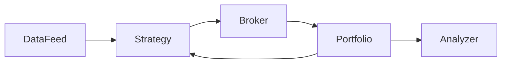

# 模块 5：回测系统

> 回测是量化系统的“仿真环境”，但它既能帮你节省真钱，也能用漂亮曲线把你骗得很惨。

## 前置知识

- 建议完成 [数据工程](./03_data_engineering.md)
- 建议完成 [技术指标与特征工程](./04_technical_indicators.md)
- 建议完成 [量化交易核心概念](./02_quant_trading_core_concepts.md)

## 学习目标

学完本模块你将能够：

1. 区分向量化回测和事件驱动回测的适用边界。
2. 正确计算并解释常见绩效指标。
3. 主动识别前视偏差、过拟合、幸存者偏差和成本忽略等回测陷阱。
4. 选择适合自己阶段的回测框架，而不是盲目追求最复杂方案。
5. 设计一个自研最小回测引擎，并说清各组件职责。

## 正文内容

### 5.1 回测基础

#### 5.1.1 什么是回测

回测（Backtesting）就是：

> 用历史市场数据模拟一套策略在过去如果按既定规则运行，会得到怎样的交易与收益表现。

它的价值在于：

- 让你在不花真钱的前提下检验策略逻辑
- 把“感觉可能赚钱”变成“在某些历史条件下确实表现如何”
- 帮你比较不同参数、不同市场、不同风险控制规则

但它从来不是“未来保证书”。  
回测回答的是：“过去如果这样做，会怎样？”  
它不回答：“未来一定也会这样。”

#### 5.1.2 回测的核心假设

任何回测都隐含了一些假设：

1. 你拿到的历史数据足够正确
2. 你的信号在那个时点真的可得
3. 你的订单能以模型设定的方式成交
4. 历史市场结构与未来不会完全断裂

这四条里，任何一条出错，回测都可能失真。

#### 5.1.3 回测 ≠ 未来收益保证

原因包括：

- 市场参与者会变化
- 成本会变化
- 拥挤交易会消耗 Alpha
- 样本可能只覆盖了一种市场状态
- 你的数据或执行模型可能过于乐观

所以成熟的态度不是“回测能不能证明策略会赚钱”，而是：

> 回测能否帮助我排除明显错误，并估计这个策略在不同条件下的大致行为边界。

### 5.2 回测架构

#### 5.2.1 向量化回测（Vectorized Backtesting）

向量化回测的核心思想，是把信号、仓位和收益表示成数组/Series，然后用矩阵或向量运算一次性完成回放。

##### 原理

1. 先根据历史数据计算每个时点的信号
2. 再把信号转成下一时点的仓位
3. 用仓位乘收益率得到策略收益

##### 代码示例

```python
import numpy as np
import pandas as pd


def vectorized_ma_backtest(df: pd.DataFrame, fast: int = 20, slow: int = 60, fee: float = 0.0005) -> pd.DataFrame:
    """Backtest a dual moving-average strategy with vectorized operations."""
    result = df.copy()
    result["ma_fast"] = result["close"].rolling(fast).mean()
    result["ma_slow"] = result["close"].rolling(slow).mean()
    result["signal"] = (result["ma_fast"] > result["ma_slow"]).astype(int)
    result["position"] = result["signal"].shift(1).fillna(0)
    result["ret"] = result["close"].pct_change().fillna(0)
    result["turnover"] = result["position"].diff().abs().fillna(0)
    result["strategy_ret"] = result["position"] * result["ret"] - result["turnover"] * fee
    result["equity"] = (1 + result["strategy_ret"]).cumprod()
    return result
```

##### 优点

- 速度快
- 实现简单
- 很适合快速验证简单逻辑

##### 缺点

- 难以精细模拟部分成交、挂单排队、复杂订单状态
- 多资产、多订单生命周期场景会迅速变复杂

##### 适用场景

- 趋势跟踪
- 简单择时
- 因子排序回测
- 初步参数扫描

#### 5.2.2 事件驱动回测（Event-Driven Backtesting）

事件驱动回测把市场过程模拟得更像真实系统。不是“一次性算完”，而是像生产系统一样按事件流推进。

##### 原理

典型循环：

1. `DataHandler` 推送一根新 K 线或一个新 tick
2. `Strategy` 基于当前可见数据生成信号
3. `Portfolio` 决定仓位调整与风险约束
4. `ExecutionHandler` 模拟订单撮合
5. 更新账户、持仓、现金和绩效

##### 核心组件

- `DataHandler`
- `Strategy`
- `Portfolio`
- `ExecutionHandler`
- `Event Queue`

##### 优点

- 更接近实盘系统结构
- 容易模拟复杂订单生命周期
- 更利于把回测和模拟盘共享代码路径

##### 缺点

- 开发成本高
- 性能通常不如纯向量化
- 容易把“研究问题”过早变成“工程问题”

##### 适用场景

- 多资产组合
- 复杂下单逻辑
- 部分成交 / 超时撤单
- 想与 Paper Trading 共用架构

#### 5.2.3 两种架构对比

| 维度 | 向量化回测 | 事件驱动回测 |
|---|---|---|
| 实现复杂度 | 低 | 高 |
| 运行速度 | 高 | 中 |
| 可解释性 | 高 | 中 |
| 成交细节模拟 | 弱 | 强 |
| 与实盘系统复用 | 较弱 | 较强 |
| 适用阶段 | 快速研究 | 系统化验证与仿真 |

经验建议：

- **第一版想法验证**：先向量化
- **准备上线或做复杂策略**：转事件驱动

### 5.3 回测关键指标

指标不是越多越好，但至少要覆盖：收益、波动、回撤、交易质量。

#### 5.3.1 累积收益率（Cumulative Return）

- **定义**：回测期间最终净值相对于初始资金的变化。
- **公式**：

$$Cumulative\ Return = \prod_{t=1}^{T}(1+r_t) - 1$$

- **直觉解释**：最后总体赚了多少。
- **合理范围参考**：取决于周期。年内 10%-30% 并不少见，远高于此需特别审查成本和偏差。

#### 5.3.2 年化收益率（Annualized Return）

- **定义**：把不同长度的收益表现换算到一年尺度。
- **公式**：

$$Annualized\ Return = \left(\prod_{t=1}^{T}(1+r_t)\right)^{\frac{K}{T}} - 1$$

其中 $K$ 为一年中的期数，例如日频常用 `252`。

- **直觉解释**：如果按这个节奏持续一年，大概赚多少。
- **合理范围参考**：对中低频个人策略，长期稳定超过 20% 已经很不容易。

#### 5.3.3 年化波动率（Annualized Volatility）

- **定义**：收益率标准差按年化缩放后的结果。
- **公式**：

$$Annualized\ Volatility = \sigma(r_t)\sqrt{K}$$

- **直觉解释**：收益路径抖得有多厉害。
- **合理范围参考**：股票型策略 10%-30% 常见；高于 40% 说明波动和杠杆风险很大。

#### 5.3.4 夏普比率（Sharpe Ratio）

- **定义**：单位总波动对应的超额收益。
- **公式**：

$$Sharpe = \frac{\mathbb{E}[R_p - R_f]}{\sigma(R_p)}$$

- **直觉解释**：每承担一单位波动，你赚到了多少超额收益。
- **合理范围参考**：
  - `< 1`：一般
  - `1-2`：不错
  - `> 2`：很好，需重点检查样本稳定性与成本建模

#### 5.3.5 索提诺比率（Sortino Ratio）

- **定义**：只把下行波动视为风险。
- **公式**：

$$Sortino = \frac{\mathbb{E}[R_p - R_f]}{\sigma_{downside}(R_p)}$$

- **直觉解释**：只针对“让人难受的波动”做惩罚。
- **合理范围参考**：通常会高于夏普；若高很多，要检查上涨与下跌分布是否极不对称。

#### 5.3.6 最大回撤（Maximum Drawdown）

- **定义**：净值从历史峰值回落的最大比例。
- **公式**：

$$MDD = \max_t\left(\frac{Peak_t - Equity_t}{Peak_t}\right)$$

- **直觉解释**：历史上最痛的一次跌幅。
- **合理范围参考**：
  - `< 10%`：保守
  - `10%-20%`：可接受但要看收益
  - `> 30%`：多数个人投资者会非常难受

#### 5.3.7 Calmar 比率

- **定义**：年化收益率除以最大回撤。
- **公式**：

$$Calmar = \frac{Annualized\ Return}{Max\ Drawdown}$$

- **直觉解释**：为了赚这些钱，你承受的最坏坑有多深。
- **合理范围参考**：
  - `< 0.5`：较弱
  - `0.5-1.0`：一般
  - `> 1.0`：不错

#### 5.3.8 胜率（Win Rate）

- **定义**：盈利交易占总交易的比例。
- **公式**：

$$Win\ Rate = \frac{\#Winning\ Trades}{\#Total\ Trades}$$

- **直觉解释**：做对的次数多不多。
- **合理范围参考**：胜率本身没意义，必须结合盈亏比。很多优秀趋势策略胜率并不高。

#### 5.3.9 盈亏比（Profit Factor / Payoff Ratio）

- **定义**：总盈利与总亏损绝对值之比。
- **公式**：

$$Profit\ Factor = \frac{\sum Profits}{|\sum Losses|}$$

- **直觉解释**：赚的钱是否足以覆盖亏的钱。
- **合理范围参考**：
  - `> 1.0` 才算没亏损结构问题
  - `1.2-1.5`：尚可
  - `> 1.5`：较好

#### 5.3.10 持仓时间统计

- **定义**：每笔交易平均、分布、最长、最短持仓时长。
- **直觉解释**：帮你判断策略到底是日内、波段还是中期趋势，不要“以为自己在做短线，实际上单子一拿拿三周”。
- **合理范围参考**：必须和策略设计一致，否则说明信号或执行存在偏移。

### 5.4 回测陷阱

这是整章最重要的部分。很多“高收益策略”不是因为聪明，而是因为回测犯错。

#### 5.4.1 前视偏差（Look-ahead Bias）

##### 定义

策略在某个历史时点使用了那个时点本不可能知道的信息。

##### 常见产生场景

- 用当日收盘价生成信号，又默认按同日收盘价成交
- 先用全样本算标准化参数，再切训练/测试
- 财报发布时间对不齐，把盘后发布当成盘中可见
- 标签和特征错位

##### 一个有前视偏差的错误回测

```python
def bad_backtest(df: pd.DataFrame) -> pd.DataFrame:
    """This version leaks future information."""
    result = df.copy()
    result["ma_fast"] = result["close"].rolling(20).mean()
    result["ma_slow"] = result["close"].rolling(60).mean()
    result["signal"] = (result["ma_fast"] > result["ma_slow"]).astype(int)
    # 错误：当日收盘生成信号，又按当日收盘收益计算
    result["strategy_ret"] = result["signal"] * result["close"].pct_change().fillna(0)
    result["equity"] = (1 + result["strategy_ret"]).cumprod()
    return result
```

为什么错？  
因为当天收盘价只有在当天结束后才完整知道。  
如果你用它生成信号，通常只能在下一根 K 线开始时执行。

##### 修正后的写法

```python
def good_backtest(df: pd.DataFrame) -> pd.DataFrame:
    """This version shifts signal execution to the next bar."""
    result = df.copy()
    result["ma_fast"] = result["close"].rolling(20).mean()
    result["ma_slow"] = result["close"].rolling(60).mean()
    result["signal"] = (result["ma_fast"] > result["ma_slow"]).astype(int)
    result["position"] = result["signal"].shift(1).fillna(0)
    result["ret"] = result["close"].pct_change().fillna(0)
    result["strategy_ret"] = result["position"] * result["ret"]
    result["equity"] = (1 + result["strategy_ret"]).cumprod()
    return result
```

##### 如何检测

- 看策略是否“神奇地总能买在当天最低附近”
- 把信号全部 `shift(1)` 后绩效是否突然塌掉
- 审查每个特征和标签的时间戳来源

##### 如何避免

1. 明确“何时可见、何时决策、何时成交”
2. 所有使用收盘数据的日线策略，默认下一根成交
3. 特征工程、标准化、特征选择都放进时间序列训练流程里

#### 5.4.2 过拟合（Overfitting）

##### 典型表现

- 参数很多
- 样本很短
- 回测指标极漂亮
- 换一段时间就不行

常见危险组合：

> 参数过多 + 样本过短 + 多轮试错 + 只汇报最好结果

##### 样本内 vs 样本外

- **样本内（In-Sample）**：用来开发与调参
- **样本外（Out-of-Sample）**：完全不参与开发，只用于验证

如果样本内惊艳、样本外平庸，那大概率不是发现了规律，而是记住了历史。

##### Walk-Forward 验证法

滚动地重复“训练 -> 验证”：

1. 用第一段历史训练
2. 在后面一小段验证
3. 窗口向前滚动
4. 重复多次

优点是更接近真实部署过程：  
你永远是在过去训练，在未来验证。

##### 组合检验（Multiple Testing Correction）

如果你试了 200 组参数、20 个因子、10 种过滤规则，最后只展示最好那一组，那么“好结果”很可能只是碰巧。

经验上至少要：

- 记录试过多少方案
- 看最优方案附近参数是否也还行
- 不只汇报冠军，还看稳定性

#### 5.4.3 幸存者偏差（Survivorship Bias）

##### 定义

只看今天还活着的资产，忽略历史中退市、暴雷、下架、归零的资产。

##### 在美股中的表现

- 只回测当前还在指数里的成分股
- 忽略退市公司

##### 在加密中的表现

- 只研究今天主流币
- 忽略曾经活跃但后来归零或下架的代币

这会让历史表现显得更美，因为你把失败者悄悄删除了。

#### 5.4.4 忽略交易成本

至少要考虑三类成本：

1. 手续费
2. 滑点
3. 市场冲击

很多高频或低边际优势策略，一旦加入成本，净值曲线会从“稳步向上”变成“贴地飞行”。

#### 5.4.5 流动性假设

坏回测常常默认：

- 任何时候都能全仓成交
- 都按一个价格成交
- 大单不会影响市场

但现实里：

- 小盘股和冷门币的盘口可能很薄
- 大单会跨多个价格档位成交
- 你甚至可能只成交一部分

### 5.5 回测框架选型

#### 5.5.1 Backtrader

- **功能**：事件驱动回测、策略类组织清晰、生态成熟
- **优点**：入门资料多，适合理解完整交易生命周期
- **缺点**：相对老派，大规模向量化研究不如新式工具灵活
- **适用场景**：个人量化、策略原型、事件驱动学习

#### 5.5.2 Zipline / Zipline-reloaded

- **功能**：经典量化研究/回测框架，时间序列资产管理味道重
- **优点**：很适合理解“研究平台式”回测工作流
- **缺点**：生态与安装体验不如一些新工具轻盈
- **适用场景**：学院派研究、资产组合型策略

#### 5.5.3 VectorBT

- **功能**：高度向量化、和 pandas/numpy 紧密结合
- **优点**：快，适合参数扫描和大规模指标实验
- **缺点**：细粒度订单生命周期仿真不如事件驱动框架自然
- **适用场景**：研究、因子实验、策略想法快速验证

#### 5.5.4 QuantConnect / Lean

- **功能**：研究、回测、数据、执行、实盘一体化
- **优点**：工程化非常强，资产类别和实盘衔接能力强
- **缺点**：学习曲线较高，本地完全掌控度不如纯自研
- **适用场景**：希望快速接近平台化量化工作流

#### 5.5.5 对比表格

| 框架 | 功能 | 学习曲线 | 美股支持 | 加密支持 | 活跃度 |
|---|---|---|---|---|---|
| Backtrader | 事件驱动回测强 | 中 | 好 | 一般，需自接数据 | 社区成熟 |
| Zipline-reloaded | 研究平台味道重 | 中高 | 好 | 一般 | 仍有维护 |
| VectorBT | 向量化研究极强 | 中 | 好 | 好 | 较活跃 |
| QuantConnect Lean | 全栈量化平台 | 高 | 很强 | 很强 | 很活跃 |

选型建议：

- 想快速验证：**VectorBT**
- 想理解回测引擎结构：**Backtrader**
- 想看平台化工作流：**Lean**
- 想做自己的系统：先理解这几类，再按需求自研最小核心

### 5.6 自研最小化回测引擎

#### 5.6.1 模块架构图



#### 5.6.2 核心组件设计

##### DataFeed：数据馈送器

职责：

- 按时间顺序输出市场数据
- 统一不同市场和时间粒度的读取方式

##### Strategy：策略引擎

职责：

- 读取当前可见数据
- 生成买卖信号

##### Broker：模拟撮合器

职责：

- 接收订单
- 根据价格、滑点、手续费进行撮合
- 返回成交结果

##### Portfolio：持仓与净值管理

职责：

- 跟踪现金、持仓、净值
- 计算仓位变化与组合收益

##### Analyzer：绩效分析器

职责：

- 统计收益、波动、回撤、胜率等指标
- 输出图表与报告

#### 5.6.3 接口定义（Python 抽象类）

```python
from __future__ import annotations

from abc import ABC, abstractmethod
from dataclasses import dataclass
from datetime import datetime


@dataclass
class Bar:
    ts: datetime
    open: float
    high: float
    low: float
    close: float
    volume: float


@dataclass
class Order:
    symbol: str
    side: str
    quantity: float


@dataclass
class Fill:
    symbol: str
    side: str
    quantity: float
    price: float
    fee: float
    ts: datetime


class DataFeed(ABC):
    @abstractmethod
    def stream(self) -> list[Bar]:
        """Return bars in chronological order."""


class Strategy(ABC):
    @abstractmethod
    def on_bar(self, bar: Bar) -> Order | None:
        """Generate an order from current market data."""


class Broker(ABC):
    @abstractmethod
    def execute(self, order: Order, bar: Bar) -> Fill:
        """Simulate order execution."""


class Portfolio(ABC):
    @abstractmethod
    def on_fill(self, fill: Fill) -> None:
        """Update positions and cash after a fill."""

    @abstractmethod
    def mark_to_market(self, bar: Bar) -> None:
        """Update equity from latest market data."""


class Analyzer(ABC):
    @abstractmethod
    def snapshot(self) -> dict:
        """Return performance summary."""
```

#### 5.6.4 一个完整示例策略的回测流程

1. `DataFeed` 逐根吐出 K 线
2. `Strategy` 计算快慢均线并决定是否发单
3. `Broker` 用下一根开盘价加滑点模拟成交
4. `Portfolio` 更新现金和持仓
5. 每根 K 线后 `mark_to_market`
6. 回测结束后 `Analyzer` 输出指标

这条链路越清晰，你越容易把回测与 Paper Trading 对齐。  
真正好的量化工程，不是回测功能有多炫，而是研究、模拟、执行三者的“接口语义”尽量一致。

## ⚠️ 常见误区与易混淆点

1. **“回测收益高，说明策略可上实盘。”**  
   错。它最多说明历史表现不错，距离可上线还差成本、风控、监控、模拟盘验证。

2. **“回测越复杂越真实，所以一定越好。”**  
   不一定。很多阶段只需要快速排错，过早做复杂仿真会拖慢研究。

3. **“夏普比率高就万事大吉。”**  
   错。你还要看回撤、交易频率、成本敏感度和样本外表现。

4. **“看起来很稳的净值曲线就是好事。”**  
   有时反而危险。太平滑的曲线常提示前视偏差、数据污染或成本忽略。

5. **“回测失败说明策略一定没价值。”**  
   不一定。也可能是数据问题、成交假设太粗糙，或者策略根本不适合你选的周期。

## 📚 推荐资源

- 书籍：《Algorithmic Trading》 by Ernest Chan  
  回测与策略开发联系紧密，适合工程师阅读。
- 书籍：《Advances in Financial Machine Learning》  
  对过拟合、样本外验证、多重检验非常有价值。
- 在线课程：QuantConnect 官方教程  
  对完整回测到实盘工作流展示很直观。
- 开源项目：[Backtrader](https://github.com/mementum/backtrader)  
  事件驱动回测的经典入门材料。
- 开源项目：[vectorbt](https://github.com/polakowo/vectorbt)  
  快速实验利器。
- 开源项目：[zipline-reloaded](https://github.com/stefan-jansen/zipline-reloaded)  
  适合理解资产管理式研究工作流。

## 💻 实践项目

### 实践 1：实现一个最小双均线回测器

- **任务描述**：用 pandas 写一个双均线策略回测器，支持手续费、仓位 shift、净值与回撤计算。
- **推荐技术栈**：Python、pandas、numpy、matplotlib
- **预期产出物**：`ma_backtest.py`、`ma_backtest_report.ipynb`
- **验收标准**：
  - 明确避免前视偏差
  - 输出累计收益、年化收益、Sharpe、最大回撤
  - 能通过调节手续费观察策略是否被成本吃掉

### 实践 2：搭一个事件驱动最小引擎

- **任务描述**：实现 `DataFeed / Strategy / Broker / Portfolio / Analyzer` 五个模块，跑通一套最小策略。
- **推荐技术栈**：Python、dataclasses、abc、pandas
- **预期产出物**：`event_backtest/` 模块目录
- **验收标准**：
  - 订单与成交对象结构清晰
  - 可在单资产上跑通一个策略
  - 输出交易明细和绩效摘要
