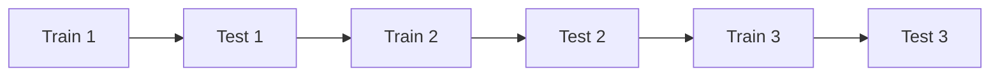

# 模块 6：策略开发

> 策略开发不是“挑一个指标阈值”，而是把市场假设、信号规则、仓位控制、风控与执行条件打包成一套可验证的交易机制。

## 前置知识

- 建议完成 [回测系统](./05_backtesting.md)
- 建议完成 [技术指标与特征工程](./04_technical_indicators.md)
- 建议完成 [风险管理与资金管理](./07_risk_management.md) 的仓位章节后再回看本章

## 学习目标

学完本模块你将能够：

1. 理解趋势、均值回归、动量、机器学习与加密特有策略的基本逻辑。
2. 把策略假设转化为明确的入场、出场、仓位和风险规则。
3. 理解每类策略擅长的市场环境与典型失效方式。
4. 用时间序列验证方法评估 ML 策略，而不是误用随机切分。
5. 设计多策略组合与资金分配框架。

## 正文内容

### 6.1 趋势跟踪策略

趋势跟踪的信仰很朴素：

> 价格一旦形成趋势，短期内更可能延续，而不是立刻反转。

这类策略不试图猜顶部和底部，而是接受“吃不到最前也吃不到最后”，换取对中段趋势的捕捉。

#### 6.1.1 双均线交叉策略

##### 原理

用一条短周期均线和一条长周期均线比较：

- 短均线在长均线之上：市场进入偏强结构
- 短均线在长均线之下：市场进入偏弱结构

##### 信号定义

- `SMA_fast > SMA_slow`：持有多头
- `SMA_fast < SMA_slow`：空仓或做空

##### 完整伪代码

```python
for each new bar:
    update sma_fast
    update sma_slow

    if no position and sma_fast crosses above sma_slow:
        submit buy order

    elif long position and sma_fast crosses below sma_slow:
        submit sell order

    apply stop loss and position sizing rules
```

##### 参数选择

- 短周期：`5-20`
- 长周期：`20-100`

思路不是“选出历史最好的一组”，而是：

- 看一片参数区域是否稳定
- 看不同市场环境下是否一致

##### 优点

- 简单、可解释
- 很适合做回测系统入门例子

##### 缺点

- 震荡市来回打脸
- 明显滞后
- 对手续费敏感

#### 6.1.2 海龟交易法（Turtle Trading）

##### 历史背景

海龟交易法源于 1980 年代，核心观点是：  
**趋势跟踪可以被系统化训练，而不是天赋。**

##### 核心规则

经典版本常包括：

- 用 Donchian 通道突破作为入场
- 用 ATR 控制头寸单位大小
- 盈利后分批加仓
- 回撤或反向突破后退出

##### 仓位管理思路

不是一次性满仓，而是：

1. 初始开 1 个单位
2. 趋势继续有利时再加仓
3. 每个单位之间按 ATR 间隔

这非常像一个渐进式扩容策略：  
系统先小流量试运行，确认方向对了再逐步放大资源。

##### 完整规则示意

- **入场**：价格突破过去 `20` 日最高点做多，跌破过去 `20` 日最低点做空
- **加仓**：每上涨 `0.5 x ATR` 再加一个单位
- **止损**：价格逆向移动 `2 x ATR` 触发退出
- **出场**：跌破较短退出通道

##### 优缺点

- 优点：大趋势里表现强，规则高度系统化
- 缺点：震荡市频繁止损，对执行和纪律要求高

#### 6.1.3 通道突破策略（Donchian Channel）

##### 通道计算

$$Upper_t = \max(High_{t-n+1}, \dots, High_t)$$

$$Lower_t = \min(Low_{t-n+1}, \dots, Low_t)$$

##### 入场/出场规则

- 收盘价向上突破上轨：做多
- 收盘价向下跌破下轨：做空或平多

##### 适用场景

- 趋势形成明显
- 大波段资产

##### 风险

- 突破失败会快速回撤
- 通道窗口过短时容易变成噪声跟踪器

### 6.2 均值回归策略

均值回归的核心假设是：

> 价格偏离正常关系或常态区间后，会倾向于回到均值附近。

这类策略与趋势策略的精神相反：

- 趋势策略看到强势会追
- 均值回归策略看到偏离会反着做

#### 6.2.1 配对交易（Pairs Trading）

##### 原理

找两只长期关系稳定的资产，例如：

- 同行业两只股票
- 同一指数的强相关成分股
- 两个高度联动的加密资产

如果它们的相对价格短期偏离过大，就押注“关系回归”。

##### 协整检验（Cointegration Test）

仅仅“相关系数高”不够，因为两条一起上涨的曲线很容易高相关。  
配对交易更在意的是：  
**两者的价差或线性组合是否稳定。**

常见做法：

- ADF（Augmented Dickey-Fuller）检验残差是否平稳
- Engle-Granger 两步法估计配对关系

##### Z-Score 信号

先构造 spread：

$$spread_t = P^{(1)}_t - \beta P^{(2)}_t$$

再标准化：

$$Z_t = \frac{spread_t - \mu}{\sigma}$$

规则示例：

- `Z > 2`：做空 spread（卖贵买便宜）
- `Z < -2`：做多 spread
- `|Z| < 0.5`：平仓

##### 风险

- 关系破裂是最大风险
- 做空腿可能有借券/融券限制
- 极端行情时“便宜的更便宜、贵的更贵”

### 6.3 动量策略

动量策略和趋势跟踪有亲缘关系，但更强调“赢家继续赢，输家继续输”。

#### 6.3.1 截面动量（Cross-sectional Momentum）

在一组资产中：

- 做多最强的一组
- 做空最弱的一组（或空仓忽略）

例子：

1. 计算过去 60 日收益率
2. 选前 20% 做多
3. 选后 20% 做空

它本质上是在比较“谁相对更强”，而不是绝对涨跌。

#### 6.3.2 时间序列动量（Time-series Momentum）

观察单个资产自己过去的方向是否延续：

- 过去 N 日收益为正 -> 做多
- 过去 N 日收益为负 -> 做空或空仓

它更像“单资产趋势策略”的一种标准化写法。

#### 6.3.3 动量崩溃（Momentum Crash）

动量策略最大风险之一，是市场突然强烈反转时，过去最强的资产变成跌得最快的资产。

这就像一个靠历史热点分配资源的系统，在流量风向急变时被反噬。

缓解方式包括：

- 做波动调整
- 加市场状态过滤
- 控制集中度

### 6.4 机器学习策略入门

机器学习策略不是“把随机森林塞进价格数据里就完事”，它本质上是：

1. 定义目标
2. 构造特征
3. 设计时间序列验证
4. 把预测转成交易信号

#### 6.4.1 问题定义

可以做成：

- **回归问题**：预测未来收益率
- **分类问题**：预测涨跌方向
- **排序问题**：预测一组资产里谁更强

#### 6.4.2 特征与标签构造

可直接复用 [模块 4](./04_technical_indicators.md) 的特征与标签体系：

- 技术指标
- 滞后收益
- 波动率
- 成交量特征
- 另类数据特征

#### 6.4.3 模型选型

入门常见模型：

- **LightGBM**：处理表格特征强，训练快
- **XGBoost**：稳健、常用
- **Random Forest**：容易上手，解释相对直观

建议顺序：

1. 先做简单基线模型
2. 再尝试更复杂模型
3. 最后才考虑深度学习

#### 6.4.4 时间序列交叉验证

##### Walk-Forward Split



##### Purged Cross-Validation

金融时间序列里，相邻样本常有重叠标签或信息污染。  
Purged CV 会在训练集和测试集之间留出“隔离带”，减少泄露。

#### 6.4.5 模型训练、预测、信号生成 pipeline

```python
def ml_strategy_pipeline(features: pd.DataFrame, labels: pd.Series):
    """Pseudo-pipeline for a time-series ML strategy."""
    results = []
    for train_idx, test_idx in walk_forward_split(features.index, train_size=252, test_size=63):
        X_train, X_test = features.loc[train_idx], features.loc[test_idx]
        y_train, y_test = labels.loc[train_idx], labels.loc[test_idx]

        model = LightGBMClassifierLike()
        model.fit(X_train, y_train)
        proba = model.predict_proba(X_test)[:, 1]

        signal = (proba > 0.55).astype(int)
        results.append((test_idx, signal))
    return results
```

注意事项：

- 训练窗口内部做标准化和特征选择
- 不要把测试期任何信息泄露到训练期
- 信号阈值本身也要纳入验证流程

#### 6.4.6 过拟合诊断

至少比较：

- 训练集表现
- 验证集表现
- 样本外表现

如果训练集胜率 70%，验证集 53%，那很可能不是发现了 Alpha，而是模型记住了噪声。

### 6.5 加密货币特有策略

#### 6.5.1 资金费率套利（Funding Rate Arbitrage）

##### 原理

当永续合约资金费率长期为正且足以覆盖成本时，可以：

- 买入现货
- 同时做空等价值永续合约

方向风险被大体对冲后，主要赚资金费率。

##### 收益来源

- 多空头寸对冲后的资金费率净收入

##### 风险

- 基差突然扩大
- 融资/借币成本变化
- 永续腿杠杆过高导致强平
- 交易所风控或资产冻结

#### 6.5.2 跨交易所价差套利

##### 原理

同一资产在不同交易所价格短暂失衡时：

- 在便宜交易所买
- 在贵的交易所卖

##### 执行难点

- 网络延迟
- 两边账户资金预分布
- 提币与链确认时间
- 风险不是“发现价差”，而是“来得及吃到价差”

这更像一个分布式系统问题，而不是单机算法问题。

#### 6.5.3 网格交易（Grid Trading）

##### 原理

在一个价格区间内预先布置多层买单和卖单，价格上下波动时不断低买高卖。

##### 参数

- 上下界
- 网格间距
- 每格仓位

##### 适用市场条件

- 震荡市
- 有明显区间边界

##### 风险

- 单边趋势中不断逆势接刀
- 上下界设置失效
- 手续费过高吞掉收益

### 6.6 多策略组合

单一策略很容易受制于特定市场环境。  
多策略组合的核心目标，是让收益来源多样化、回撤更平滑。

#### 6.6.1 为什么需要多策略组合

- 趋势策略适合趋势市
- 均值回归适合震荡市
- 套利策略更依赖结构性偏差

把它们组合起来，可以降低某一类市场状态对整体表现的统治力。

#### 6.6.2 资金分配方法

##### 等权

最简单：每个策略给相同权重。

##### 按夏普比率加权

历史夏普高的策略给更高权重，但要注意样本稳定性。

##### 风险平价

按波动率倒数分配，让高波动策略少拿仓位、低波动策略多拿仓位。

#### 6.6.3 策略相关性分析

如果两个策略都在做类似趋势跟踪，只是参数不同，看起来是两个策略，实际上可能只是一个策略的两个分身。

因此要看：

- 收益相关性
- 回撤同步性
- 信号重叠程度

#### 6.6.4 动态分配

可根据以下因素调整权重：

- 近期绩效
- 市场状态
- 风险预算占用

但别把动态分配调成“又一个过拟合引擎”。  
如果权重规则过于复杂，组合层也会成为新的过拟合来源。

## ⚠️ 常见误区与易混淆点

1. **“策略逻辑对就够了，仓位和风控以后再补。”**  
   错。没有仓位和风控的策略，只是一段方向判断代码。

2. **“回测里表现最好的参数就是最优参数。”**  
   错。最好的单点参数往往最不稳，参数区域稳定性更重要。

3. **“机器学习一定比经典策略高级。”**  
   错。很多 ML 策略只是把简单问题复杂化，最后输给一个朴素动量模型。

4. **“套利就等于无风险。”**  
   错。套利策略常常把方向风险换成执行风险、信用风险和流动性风险。

5. **“做了多策略组合就天然分散。”**  
   错。相关性高的策略堆在一起，只是把同一种风险换了几个名字。

## 📚 推荐资源

- 书籍：《Algorithmic Trading》 by Ernest Chan  
  很适合把经典策略家族串起来理解。
- 书籍：《Following the Trend》  
  趋势策略与风险控制讲得很实用。
- 书籍：《Advances in Financial Machine Learning》  
  机器学习策略设计和验证细节很重要。
- 在线课程：QuantInsti 的策略课程与博客  
  趋势、套利、动量、因子都有入门材料。
- 开源项目：[Backtrader](https://github.com/mementum/backtrader)  
  很适合实现趋势和均值回归策略原型。
- 开源项目：[CCXT](https://github.com/ccxt/ccxt)  
  加密多交易所策略几乎绕不开。
- 官方文档：[Binance Spot API Docs](https://developers.binance.com/docs/binance-spot-api-docs/rest-api/market-data-endpoints)  
  做加密策略时要尊重真实接口和限频边界。

## 💻 实践项目

### 实践 1：实现三类经典策略并做横向对比

- **任务描述**：至少实现一个趋势策略、一个均值回归策略和一个动量策略，在同一份市场数据上做回测对比。
- **推荐技术栈**：Python、pandas、statsmodels、matplotlib
- **预期产出物**：`strategies/` 目录、`strategy_comparison.ipynb`
- **验收标准**：
  - 三类策略的信号定义明确
  - 每个策略都加入基础手续费和风险控制
  - 能解释为什么它们在不同市场状态下表现不同

### 实践 2：做一个最小 ML 策略研究流水线

- **任务描述**：构造特征与标签，使用时间序列切分训练一个二分类模型，并把预测结果转成交易信号回测。
- **推荐技术栈**：Python、pandas、scikit-learn、LightGBM
- **预期产出物**：`ml_strategy_pipeline.py`、`ml_strategy_report.md`
- **验收标准**：
  - 严格使用时间序列验证
  - 至少输出训练集、验证集、样本外三段表现
  - 明确分析 3 个可能的过拟合来源
