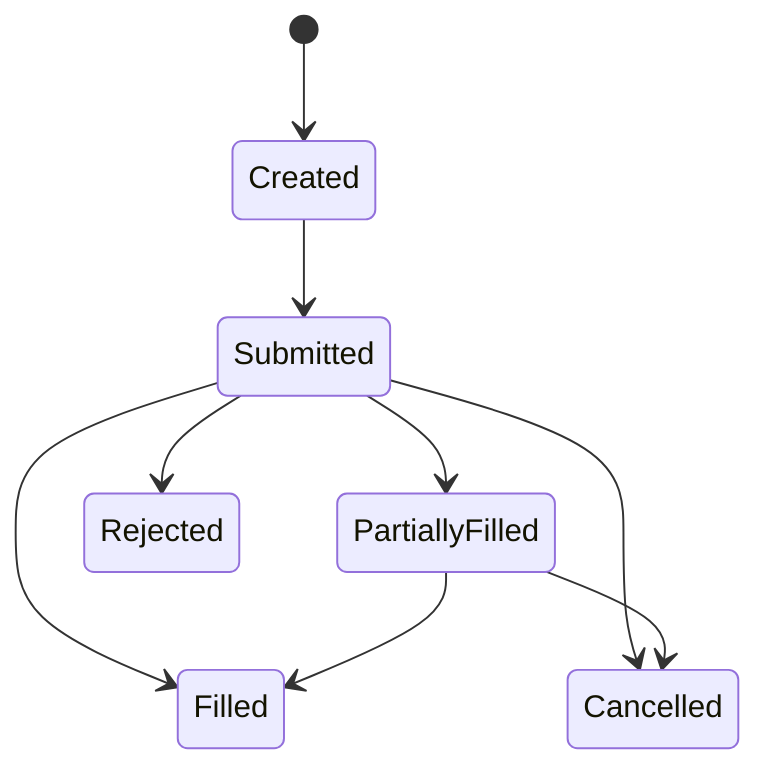

# 模块 8：执行系统

> 回测告诉你“理论上应该怎么做”，执行系统决定你“实际上能不能做出来”。

## 前置知识

- 建议完成 [回测系统](./05_backtesting.md)
- 建议完成 [风险管理与资金管理](./07_risk_management.md)

## 学习目标

学完本模块你将能够：

1. 理解回测、模拟盘与实盘之间的系统差异。
2. 设计交易所 / 券商 API 接入层，并理解认证与限频机制。
3. 设计 OMS（订单管理系统）状态机和幂等机制。
4. 用合理的滑点与成交模型约束回测与模拟盘。
5. 判断什么时候应该做延迟优化，什么时候不应该被“高频幻觉”带跑。

## 正文内容

### 8.1 模拟盘（Paper Trading）

#### 8.1.1 为什么需要模拟盘

模拟盘不是“假的实盘”，它的价值在于：

- 用真实行情驱动
- 验证信号链路、下单逻辑、风控规则、监控与告警
- 不承担真钱损失

如果回测像单元测试，那么模拟盘更像预发布环境。

#### 8.1.2 实现方式

##### 交易所自带沙盒

优点：

- 更接近真实 API
- 可以验证签名、限频、订单状态接口

缺点：

- 沙盒流动性和真实市场通常仍有差距

##### 自建模拟撮合

优点：

- 完全可控
- 可以按自己的成交模型重放

缺点：

- 需要自己维护撮合逻辑
- 容易不小心“模拟得过于乐观”

#### 8.1.3 模拟盘与回测的差异

| 维度 | 回测 | 模拟盘 |
|---|---|---|
| 数据 | 历史数据 | 实时数据 |
| 可重复性 | 高 | 低 |
| 执行时延 | 通常离线估计 | 接近真实链路 |
| 主要目标 | 评估历史行为 | 验证在线系统稳定性 |

### 8.2 交易所 API 对接

#### 8.2.1 REST API

常用功能：

- 下单
- 撤单
- 查余额
- 查持仓
- 查历史订单

REST 适合请求-响应型操作，但不要用它硬撑实时订单状态更新。

#### 8.2.2 WebSocket API

常用功能：

- 实时行情
- 实时订单状态
- 实时账户变动

WebSocket 适合“状态流”，但你需要处理：

- 断线重连
- 心跳
- 重复消息
- 补数

#### 8.2.3 认证与签名机制

加密交易所常见方式：

- `API Key`
- `Secret`
- `Timestamp`
- `HMAC` 签名

示意代码：

```python
import hashlib
import hmac


def sign_request(secret: str, payload: str) -> str:
    """Return HMAC-SHA256 hex digest."""
    return hmac.new(secret.encode(), payload.encode(), hashlib.sha256).hexdigest()
```

#### 8.2.4 频率限制（Rate Limit）处理

原则：

- 下单接口和行情接口限频分开管理
- WebSocket 能推就别用高频 REST 轮询
- 对 `429` 和特定错误码做退避重试
- 降级时优先保护交易安全，不要暴力重试

#### 8.2.5 Binance API 与 Alpaca API 的对接要点

##### Binance

- 现货、合约接口区分明确
- 多数公共行情接口免费，但有 request weight 限制
- 资金费率、盘口、K 线等研究信息丰富
- 做合约时要特别关注保证金和持仓模式

##### Alpaca

- 美股与加密接口体系比较统一
- 适合把数据与交易放在同一供应商链路中验证
- 对美股交易时段、订单状态、Paper Trading 支持较友好

### 8.3 订单管理系统（OMS）

OMS 的核心任务，是把“策略想做什么”翻译成“系统实际做了什么”。

#### 8.3.1 订单状态机设计



#### 8.3.2 部分成交处理

现实里，大单不一定一次吃完。  
因此 OMS 必须能表示：

- 原始订单数量
- 已成交数量
- 剩余数量
- 平均成交价

否则你的持仓和风控就会和真实世界脱节。

#### 8.3.3 超时订单处理

常见策略：

- 一段时间未成交则撤单
- 撤单后重挂更优价格
- 超时后降级成市价单

但一定要明确：

- 什么情况下允许追价
- 什么情况下宁可错过也不追

#### 8.3.4 订单幂等性设计

幂等性非常关键。  
否则网络重试、客户端重发、超时不确定都可能导致重复下单。

建议：

- 每个策略动作生成唯一 `client_order_id`
- 服务端记录“同一个意图是否已发出”
- 重试先查状态，再决定是否重新提交

### 8.4 滑点与成交模型

#### 8.4.1 滑点来源

- 市场波动
- 价差
- 深度不足
- 排队位置变化
- 网络与处理延迟

#### 8.4.2 简单滑点模型

##### 固定比例

$$Executed\ Price = Price \times (1 \pm s)$$

##### 固定点差

买入加一个固定 tick，卖出减一个固定 tick。

适合：

- 入门回测
- 快速做保守估计

#### 8.4.3 基于 Order Book 深度的滑点估算

如果有盘口深度，可以按“吃单”方式累积：

1. 先吃最优价位数量
2. 不够再吃下一档
3. 直到满足订单数量

平均成交价就是多个档位加权结果。

#### 8.4.4 市场冲击模型简介

大资金订单不只是“被动接受市场”，还会主动改变市场。  
市场冲击模型试图估计：

- 这笔订单本身对价格造成多大偏移

对个人交易者来说，很多时候只需做保守滑点假设；  
真正需要精细冲击模型的，往往是更大规模和更高频策略。

### 8.5 延迟优化

#### 8.5.1 延迟组成

- 网络延迟
- 本地处理延迟
- 券商/交易所网关延迟
- 交易所内部撮合延迟

#### 8.5.2 基础优化

- 连接池复用
- 异步 I/O
- 减少阻塞调用
- 把行情与下单通道拆开
- 部署到更靠近交易所或券商网关的位置

#### 8.5.3 高频交易（HFT）科普

HFT 关注的是微秒到毫秒级优势，通常涉及：

- 极低延迟网络
- 专线
- 内核调优
- 极高质量盘口数据

这和多数个人量化系统不是一个游戏层级。

#### 8.5.4 对个人量化交易者的提醒

> 对大多数个人量化开发者，真正的瓶颈通常不是“延迟还不够低”，而是“策略边际优势太薄、风控不够严、执行不够稳”。

所以延迟优化的正确顺序往往是：

1. 先确保功能正确
2. 再确保异常可控
3. 最后才优化性能

## ⚠️ 常见误区与易混淆点

1. **“回测能成交，实盘大概率也能成交。”**  
   错。真实订单生命周期复杂得多。

2. **“有 Paper Trading 就等于已经验证过实盘。”**  
   错。Paper 只能验证一部分链路，不能替代真钱环境。

3. **“订单状态只有成功和失败两种。”**  
   错。部分成交、撤单中、拒单、超时等状态都很重要。

4. **“所有性能优化都值得做。”**  
   错。对中低频策略，稳定性和风控收益通常远高于盲目压毫秒。

5. **“重试一定比丢单好。”**  
   不一定。没有幂等设计的重试，很可能把小问题变成重复下单事故。

## 📚 推荐资源

- 书籍：《Building Winning Algorithmic Trading Systems》  
  对执行、订单和工程化很有帮助。
- 在线课程：各大交易所 / Alpaca / IBKR 官方 API 教程  
  实操价值高。
- 开源项目：[CCXT](https://github.com/ccxt/ccxt)  
  很适合理解统一下单接口。
- 官方文档：[Binance Spot API Docs](https://developers.binance.com/docs/binance-spot-api-docs/rest-api/market-data-endpoints)  
  适合了解真实限频与订单接口边界。
- 官方文档：[Alpaca Trading API](https://docs.alpaca.markets/)  
  模拟盘和实盘流程都值得看。

## 💻 实践项目

### 实践 1：实现一个最小 OMS

- **任务描述**：实现订单状态机、部分成交更新、撤单、幂等客户端订单号管理。
- **推荐技术栈**：Python、FastAPI、PostgreSQL 或 SQLite
- **预期产出物**：`oms/` 模块、`orders.db`
- **验收标准**：
  - 订单状态至少覆盖 Created/Submitted/PartiallyFilled/Filled/Cancelled/Rejected
  - 支持按 `client_order_id` 去重
  - 可输出完整订单生命周期日志

### 实践 2：做一个 Paper Trading 原型

- **任务描述**：用实时行情驱动一个简单策略，在不下真钱的情况下记录信号、订单、成交和净值。
- **推荐技术栈**：Python、asyncio、websockets、pandas
- **预期产出物**：`paper_trader.py`、`paper_report.md`
- **验收标准**：
  - 能持续处理实时行情
  - 发生断线时能够恢复
  - 能区分“信号触发成功”和“订单真正成交成功”
