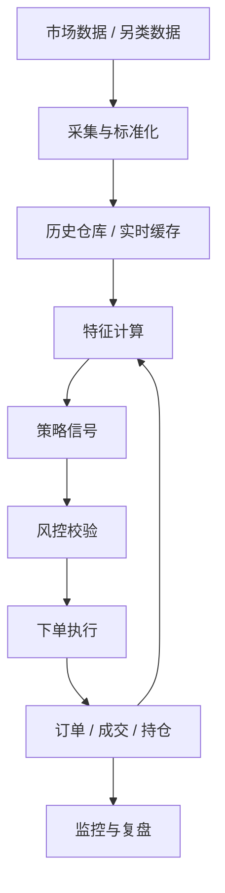

# 模块 9：系统架构与工程实践

> 真正可长期运行的量化系统，不是一堆脚本拼在一起，而是一套边界清晰、状态可追踪、异常可定位的工程系统。

## 前置知识

- 建议完成 [数据工程](./03_data_engineering.md)
- 建议完成 [回测系统](./05_backtesting.md)
- 建议完成 [执行系统](./08_execution_system.md)

## 学习目标

学完本模块你将能够：

1. 画出量化交易系统的分层架构与数据流。
2. 根据职责划分数据层、研究层、策略层、风控层、执行层与监控层。
3. 为本地优先量化系统选择合适的技术栈与调度方式。
4. 建立日志、监控、告警、配置管理和上线流程。
5. 设计一个适合 Python 项目的目录结构模板。

## 正文内容

### 9.1 整体架构

#### 9.1.1 分层架构图


#### 9.1.2 各层职责说明

##### 数据层

- 行情采集
- 历史仓库
- 另类数据接入
- 原始数据与标准数据管理

##### 因子 / 特征层

- 技术指标
- 因子计算
- 标签构造
- 特征存储与版本化

##### 策略层

- 信号生成
- 参数管理
- 策略版本与配置

##### 风控层

- 仓位限制
- 日亏损限制
- 策略熔断
- 组合约束

##### 执行层

- OMS
- Broker Adapter
- Paper / Live 执行

##### 监控层

- 收益与风险仪表盘
- API 健康检查
- 延迟与异常告警
- 审计日志

#### 9.1.3 数据流向图



### 9.2 技术选型

#### 9.2.1 主语言：Python

为什么大多数量化系统用 Python 起步：

- 数据处理生态成熟
- 科学计算库丰富
- 研究与工程之间切换成本低

适合：

- 策略开发
- 特征工程
- 回测
- API 编排

#### 9.2.2 可选高性能模块：Rust / Go / C++

当你遇到性能瓶颈时，可把热点模块下沉：

- **Rust**：安全、适合计算核心和高性能解析
- **Go**：适合服务化、并发 I/O
- **C++**：性能强，但工程复杂度高

典型下沉对象：

- 回测热路径
- 行情解析
- 高频撮合模拟

#### 9.2.3 数据处理：pandas / polars / numpy

- `pandas`：最通用
- `polars`：更现代，部分场景更快
- `numpy`：底层数组运算基础

#### 9.2.4 异步框架：asyncio + aiohttp / httpx

适合：

- REST 批量拉数
- WebSocket 实时订阅
- 多交易所并发请求

#### 9.2.5 消息队列（可选）

| 方案 | 适合场景 | 特点 |
|---|---|---|
| Redis Pub/Sub | 轻量实时广播 | 简单，但持久化和重放能力有限 |
| RabbitMQ | 业务消息流 | 路由灵活，适合工作队列 |
| Kafka | 高吞吐日志与流处理 | 重放和扩展强，但运维更重 |

### 9.3 任务调度

#### 9.3.1 APScheduler

- 轻量
- 适合单机部署
- 非常适合个人量化环境中的定时拉数、日报生成

#### 9.3.2 Celery + Redis/RabbitMQ

- 更适合分布式任务
- 支持任务队列、重试、异步 worker
- 运维成本高于 APScheduler

#### 9.3.3 Cron

- 最简单
- 稳定
- 可观测性和应用内部协同能力较弱

#### 9.3.4 选型对比

| 方案 | 部署复杂度 | 可观测性 | 分布式能力 | 适合场景 |
|---|---|---|---|---|
| Cron | 低 | 低 | 低 | 简单定时脚本 |
| APScheduler | 低 | 中 | 低 | 单机应用内调度 |
| Celery | 中高 | 中高 | 高 | 多 worker 异步任务 |

### 9.4 日志与监控

#### 9.4.1 结构化日志

推荐输出结构化字段：

- `strategy_id`
- `symbol`
- `order_id`
- `event_type`
- `latency_ms`
- `risk_decision`

不要只写“下单失败”这种文学化日志。  
系统出问题时，你需要可检索字段，不需要散文。

#### 9.4.2 关键指标监控

- 策略收益
- 当前回撤
- 持仓敞口
- API 连通性
- WebSocket 断线次数
- 下单成功率
- 平均成交滑点

#### 9.4.3 Prometheus + Grafana 仪表盘设计

建议至少做三类看板：

1. **系统健康**：CPU、内存、错误率、连接状态
2. **交易健康**：订单数、成交率、延迟、拒单率
3. **策略健康**：净值、回撤、风险敞口、风控命中

#### 9.4.4 告警规则

- 策略净值跌破阈值
- API 连续失败
- WebSocket 断连超时
- 日亏损超限
- 单策略权重异常

### 9.5 CI/CD 与版本管理

#### 9.5.1 策略代码的 Git 版本管理

建议策略也进入 Git，而不是散落在 Notebook 里。  
这样你才能回答：

- 这条策略什么时候改过
- 为什么改
- 改完后绩效有什么变化

#### 9.5.2 参数配置管理

常见方式：

- `config` 文件
- 环境变量
- 配置中心

建议分层：

- 策略参数 -> 可版本化配置文件
- 密钥 -> 环境变量或密钥管理工具
- 部署配置 -> 环境级配置

#### 9.5.3 策略上线流程

推荐流程：

1. 回测通过
2. 模拟盘验证
3. 灰度实盘
4. 全量运行

不要跳步骤。  
量化系统里很多事故，都是“直接上真钱看看”。

#### 9.5.4 自动化测试

应覆盖：

- 单元测试
- 特征与标签测试
- API 合约测试
- 回测回归测试

回测回归测试很重要，因为它能防止你改了一行代码，策略结果却悄悄漂移。

### 9.6 项目目录结构建议

下面给出一个适合 Python 量化系统的目录模板：

```text
quant_system/
├── pyproject.toml
├── README.md
├── configs/
│   ├── app.toml
│   ├── strategies/
│   └── brokers/
├── data/
│   ├── raw/
│   ├── canonical/
│   └── features/
├── notebooks/
├── src/
│   └── quant_system/
│       ├── data/
│       │   ├── collectors/
│       │   ├── cleaners/
│       │   └── storage.py
│       ├── features/
│       ├── backtest/
│       ├── strategy/
│       ├── risk/
│       ├── execution/
│       ├── broker/
│       ├── portfolio/
│       ├── monitor/
│       ├── reports/
│       └── cli.py
├── tests/
│   ├── data/
│   ├── features/
│   ├── backtest/
│   ├── strategy/
│   ├── risk/
│   └── execution/
└── scripts/
    ├── run_backtest.py
    ├── run_paper.py
    └── sync_data.py
```

设计原则：

- 研究代码与生产代码分层
- 数据原始层与标准层分开
- 风控、执行、策略不要揉成一个大文件

## ⚠️ 常见误区与易混淆点

1. **“先写脚本，后面再重构成系统。”**  
   可以，但要尽早建立边界，否则脚本很快会变成无从下手的泥团。

2. **“所有逻辑都写在策略类里最省事。”**  
   错。策略、风控、执行和数据处理混在一起，后期很难维护。

3. **“监控只在实盘时需要。”**  
   错。模拟盘阶段就应该建立监控习惯。

4. **“个人项目不用做版本管理和配置管理。”**  
   错。量化项目里最难排查的常常是‘上周到底改了什么参数’。

5. **“架构设计会拖慢开发。”**  
   粗糙的架构会更慢，因为每次改动都会牵连全局。

## 📚 推荐资源

- 书籍：《Designing Data-Intensive Applications》  
  对分层、数据流、可靠性和可观测性极有帮助。
- 书籍：《Architecture Patterns with Python》  
  非常适合把量化系统里的职责边界想清楚。
- 在线课程：Prometheus/Grafana 官方文档与教程  
  监控是量化系统的生命线之一。
- 开源项目：[Lean](https://www.quantconnect.com/docs/v2/writing-algorithms/key-concepts/algorithm-engine)  
  值得拿来研究一体化量化平台是怎么分层的。

## 💻 实践项目

### 实践 1：画出你的量化系统蓝图

- **任务描述**：基于你当前的策略与执行设想，画出一个端到端架构图，包含数据、研究、回测、风控、执行和监控。
- **推荐技术栈**：Markdown、Mermaid
- **预期产出物**：`system_architecture.md`
- **验收标准**：
  - 每层职责边界清楚
  - 数据流向可解释
  - 至少列出 3 个你准备如何观测的关键指标

### 实践 2：创建项目骨架并跑通最小链路

- **任务描述**：搭一个包含数据拉取、特征计算、回测、Paper Trading 占位模块的项目目录结构。
- **推荐技术栈**：Python、FastAPI、APScheduler、PostgreSQL/SQLite
- **预期产出物**：可运行的仓库骨架
- **验收标准**：
  - 模块边界符合目录设计
  - 至少有一条从数据到回测的可执行链路
  - 日志和配置文件被纳入设计
