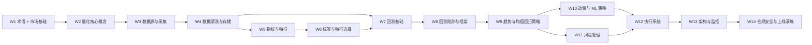

# 12-16 周学习路线图

> 用 14 周把“会写代码但不懂金融”推进到“能独立设计并开发一套覆盖加密货币与美股的量化交易系统”。

## 使用方式

本路线图按“先建立概念，再搭底座，后做系统”的顺序组织。你可以把它当作一个课程计划，也可以当作项目里程碑：

- **必修**：如果你的目标是独立做出一套可靠的量化系统，这部分必须完成。
- **选修/进阶**：如果你时间有限，可以先跳过；如果你想做得更像生产系统，再补回来。
- **全职学习**：按每天 4 小时估算。
- **业余学习**：按每天 1.5 小时估算。

## 依赖关系图

## 节奏建议

| 模式 | 每周建议时长 | 节奏说明 |
|---|---|---|
| 全职学习 | 24-28 小时 | 适合 14 周内做出一版可回测、可模拟、可监控的系统原型 |
| 业余学习 | 9-11 小时 | 适合白天上班、晚上推进，重点是持续性而不是日强度 |

## 14 周详细计划

### 第 1 周：建立共同语言

- **学习模块**：`必修` [00 术语速查表](./00_glossary.md)、[01 金融市场基础](./01_financial_market_basics.md)
- **核心知识点**：
  - 美股和加密货币市场的差异
  - OHLCV、订单簿、滑点、流动性、杠杆、保证金
  - 为什么“下单”不是一个简单的同步函数调用
- **实践任务**：
  - 用自己的话写一份 20 个术语的白话解释清单
  - 画一张“成交链路图”：行情源 -> 策略 -> 订单 -> 成交 -> 持仓
- **预计耗时**：
  - 全职：26 小时
  - 业余：10 小时

### 第 2 周：量化核心概念

- **学习模块**：`必修` [02 量化交易核心概念](./02_quant_trading_core_concepts.md)
- **核心知识点**：
  - Alpha、Beta、因子、信号、特征、标签
  - 主观交易和系统化交易的差异
  - 策略生命周期与研究闭环
- **实践任务**：
  - 选 3 个你直觉能想到的“因子”，写出它们的计算方式和可能失效原因
  - 用 Mermaid 画出“因子 -> 信号 -> 订单 -> 交易结果 -> 复盘”的流程图
- **预计耗时**：
  - 全职：24 小时
  - 业余：9 小时

### 第 3 周：数据源与采集

- **学习模块**：`必修` [03 数据工程](./03_data_engineering.md) 的 3.1-3.2
- **核心知识点**：
  - 美股/加密货币主流数据源
  - REST 轮询 vs WebSocket 推送
  - 增量抓取、重试、限频、幂等
- **实践任务**：
  - 分别接入一个美股源和一个加密源，抓取 BTC/USDT 与 AAPL 的日线数据
  - 设计一份采集任务配置文件，包含 symbol、时间粒度、起止时间、重试次数
- **预计耗时**：
  - 全职：26 小时
  - 业余：10 小时

### 第 4 周：数据清洗与存储

- **学习模块**：`必修` [03 数据工程](./03_data_engineering.md) 的 3.3-3.5
- **核心知识点**：
  - Parquet、PostgreSQL、时序数据库的使用边界
  - 复权、时区、缺失值、异常值、数据对齐
  - 另类数据的接入原则
- **实践任务**：
  - 实现一个“小型历史仓库”：原始数据目录 + 清洗后目录 + 元数据表
  - 用同一时间轴对齐 AAPL 日线与 BTC 1h K 线，理解频率不匹配的处理方式
- **预计耗时**：
  - 全职：24 小时
  - 业余：9 小时

### 第 5 周：技术指标与特征工程

- **学习模块**：`必修` [04 技术指标与特征工程](./04_technical_indicators.md) 的 4.1-4.2
- **核心知识点**：
  - SMA、EMA、RSI、MACD、布林带、ATR、VWAP、OBV
  - 滞后特征、滚动统计、收益率、波动率特征
- **实践任务**：
  - 不依赖 `ta-lib`，手写 5 个技术指标
  - 输出一个包含 30+ 列特征的 DataFrame，并说明每列的业务含义
- **预计耗时**：
  - 全职：28 小时
  - 业余：11 小时

### 第 6 周：标签构造与特征选择

- **学习模块**：`必修` [04 技术指标与特征工程](./04_technical_indicators.md) 的 4.3-4.4
- **核心知识点**：
  - 回归标签、分类标签、三分类标签
  - 信息泄露与前视偏差
  - 相关性过滤、互信息、RFE、树模型重要性
- **实践任务**：
  - 为 BTC 和 AAPL 分别生成“未来 5 根 K 线收益率”标签
  - 比较随机切分和时间序列切分下的特征重要性差异
- **预计耗时**：
  - 全职：24 小时
  - 业余：9 小时

### 第 7 周：回测基础

- **学习模块**：`必修` [05 回测系统](./05_backtesting.md) 的 5.1-5.3
- **核心知识点**：
  - 向量化回测 vs 事件驱动回测
  - 累积收益、年化收益、夏普、索提诺、最大回撤、Calmar
  - 手续费、滑点、成交成本
- **实践任务**：
  - 用 pandas 实现一个最小双均线回测
  - 为回测结果输出净值曲线、回撤曲线和指标摘要
- **预计耗时**：
  - 全职：26 小时
  - 业余：10 小时

### 第 8 周：回测陷阱与框架选型

- **学习模块**：`必修` [05 回测系统](./05_backtesting.md) 的 5.4-5.6
- **核心知识点**：
  - 前视偏差、过拟合、幸存者偏差、流动性假设
  - Walk-Forward 验证
  - Backtrader、VectorBT、Lean 的优劣
- **实践任务**：
  - 重写第 7 周的回测，让它显式避免前视偏差
  - 写一份框架选型 memo：你的系统为什么先用哪种回测架构
- **预计耗时**：
  - 全职：24 小时
  - 业余：9 小时

### 第 9 周：趋势与均值回归策略

- **学习模块**：`必修` [06 策略开发](./06_strategy_development.md) 的 6.1-6.2
- **核心知识点**：
  - 双均线、海龟、Donchian
  - 配对交易、协整、Z-Score
  - 参数与制度型失效
- **实践任务**：
  - 回测一个双均线趋势策略和一个配对交易策略
  - 比较它们在趋势市与震荡市中的表现差异
- **预计耗时**：
  - 全职：28 小时
  - 业余：11 小时

### 第 10 周：动量与机器学习策略

- **学习模块**：`必修` [06 策略开发](./06_strategy_development.md) 的 6.3-6.5
- **核心知识点**：
  - 截面动量、时间序列动量
  - Walk-Forward Split、Purged CV
  - 资金费率套利、跨所价差、网格交易
- **实践任务**：
  - 做一个最小 ML pipeline：特征构造 -> 时间序列切分 -> 训练 -> 生成信号
  - 用历史资金费率数据写一个套利收益估算脚本
- **预计耗时**：
  - 全职：28 小时
  - 业余：11 小时

### 第 11 周：风险管理与资金管理

- **学习模块**：`必修` [07 风险管理与资金管理](./07_risk_management.md)
- **核心知识点**：
  - 固定比例法、凯利、风险预算法、风险平价
  - 固定止损、追踪止损、ATR 止损
  - VaR、CVaR、组合相关性
- **实践任务**：
  - 给前面任一策略加上三种仓位控制规则并比较净值曲线
  - 设计一个风险规则引擎接口
- **预计耗时**：
  - 全职：24 小时
  - 业余：9 小时

### 第 12 周：执行系统

- **学习模块**：`必修` [08 执行系统](./08_execution_system.md)
- **核心知识点**：
  - 模拟盘与回测的差异
  - REST / WebSocket、签名认证、频率限制
  - OMS、订单状态机、成交模型、延迟构成
- **实践任务**：
  - 实现一个最小 Paper Trading 引擎
  - 建立一个订单生命周期日志，记录从创建到成交的每一步
- **预计耗时**：
  - 全职：26 小时
  - 业余：10 小时

### 第 13 周：系统架构与工程实践

- **学习模块**：`必修` [09 系统架构与工程实践](./09_system_architecture.md)
- **核心知识点**：
  - 分层架构、任务调度、监控、告警、配置管理
  - 本地研究环境与 7x24 执行环境的差异
  - CI/CD 和回测回归测试
- **实践任务**：
  - 画出自己的量化系统架构图
  - 为策略执行、数据抓取、监控告警设计三套独立服务边界
- **预计耗时**：
  - 全职：24 小时
  - 业余：9 小时

### 第 14 周：合规、安全与上线演练

- **学习模块**：`必修` [10 合规、安全与实战](./10_compliance_and_security.md)
- **核心知识点**：
  - PDT、KYC/AML、税务基础
  - API Key 管理、IP 白名单、冷热钱包、2FA/U2F
  - 实盘上线 checklist
- **实践任务**：
  - 写一份“我的实盘上线清单”，逐项说明如何验证
  - 做一次桌面演练：API 断线、连续亏损、订单拒绝时系统如何处置
- **预计耗时**：
  - 全职：22 小时
  - 业余：8 小时

## 选修/进阶插槽

如果你采用 16 周节奏，可以在第 15-16 周加入以下进阶主题：

- **选修 A：另类数据研究**
  - 学习 Glassnode、Dune、新闻事件与情绪因子
  - 目标：做一个简单的“价格 + 情绪”混合信号
- **选修 B：生产化演练**
  - 加入 Prometheus/Grafana、断线重连、幂等下单、审计日志
  - 目标：把系统从“实验脚本”升级为“可守夜的服务”
- **选修 C：多策略组合**
  - 研究相关性矩阵、风险预算、策略分层
  - 目标：构建一个候选池 -> 运行池 -> 退役池的组合治理流程

## 全职学习 vs 业余学习

| 对比项 | 全职学习（每天 4h） | 业余学习（每天 1.5h） |
|---|---|---|
| 节奏 | 每周可完成一个模块块状主题 | 每周更适合“读 + 写 + 实验”切成三段 |
| 建议方式 | 先完成阅读，再集中做实践 | 把每天固定为 30 分钟阅读 + 60 分钟编码 |
| 风险 | 学得快，但容易忽略复盘 | 节奏慢，但更容易形成稳定积累 |
| 关键提醒 | 每周至少写一次总结，防止只堆输入 | 不要因为时间少就跳过实践，实践才是真正记忆点 |

## 完成标准

当你满足下面四条时，就可以认为自己已经完成了“从零到可独立开发量化系统”的第一阶段：

1. 能解释清楚至少 30 个核心术语，并知道它们在系统中的位置。
2. 能独立抓取、清洗并存储至少两个市场的数据。
3. 能独立实现一个最小回测器、一个最小策略、一个最小风控规则引擎。
4. 能写出一份实盘前检查清单，并知道哪些风险不能靠代码完全消灭。

下一步建议回到 [README](./README.md)，把这条路线图和模块文档配合使用；真正做项目时，则把 [回测系统](./05_backtesting.md)、[策略开发](./06_strategy_development.md)、[执行系统](./08_execution_system.md) 当作你的主工作手册。
