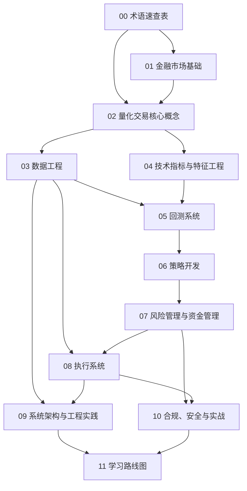

# QuantPilot 量化交易完整教程

> 面向后端工程师的量化交易从零到实战学习路径：先补金融直觉，再搭数据、回测、策略、风控与执行闭环。

## 教程简介

这套文档写给“工程能力强、金融基础为零”的读者。你已经熟悉 Python、REST API、数据库、Linux，也知道怎样把一个复杂系统拆成模块，但当你第一次看到 K 线、因子、Alpha、回测、资金费率、订单簿这些词时，可能会像第一次接手一个陌生遗留系统一样摸不着边。

本教程的目标不是让你背下一堆术语，而是帮助你建立一套可落地的工程化认知：

- 先理解市场规则，知道“交易对象”和“成交机制”到底是什么。
- 再把量化术语翻译成工程语言，理解因子、信号、特征、标签、风险约束分别像系统里的哪一层。
- 然后学习如何采集、清洗、存储和回放数据，避免“垃圾进，垃圾出”。
- 最后把策略、回测、风控、执行、监控、合规串成一条真正能上线的工作流。

## 前置要求

- 会使用 Python 进行数据处理和脚本开发
- 理解 HTTP API、数据库表设计、异步任务、日志、监控等后端常识
- 能阅读 Markdown、Mermaid、基础数学公式
- 不要求任何金融背景，本教程会在概念第一次出现时给出解释

## 10 大模块一句话概要

1. [金融市场基础](./01_financial_market_basics.md)：先搞清楚交易发生在哪、怎么成交、为什么会有滑点与流动性风险。
2. [量化交易核心概念](./02_quant_trading_core_concepts.md)：把 Alpha、Beta、因子、信号、特征、策略生命周期串成一条完整心智模型。
3. [数据工程](./03_data_engineering.md)：学会选数据源、搭采集链路、做清洗对齐和历史存储。
4. [技术指标与特征工程](./04_technical_indicators.md)：把价格和成交量序列加工成可计算、可训练、可解释的特征。
5. [回测系统](./05_backtesting.md)：用历史数据搭建“策略仿真环境”，评估收益、波动、回撤和各种偏差。
6. [策略开发](./06_strategy_development.md)：从趋势、均值回归、动量到机器学习和加密套利，学习常见策略家族。
7. [风险管理与资金管理](./07_risk_management.md)：解决“能不能活下来”的问题，而不是只盯着收益率。
8. [执行系统](./08_execution_system.md)：理解模拟盘、交易所 API、OMS、成交模型和延迟优化。
9. [系统架构与工程实践](./09_system_architecture.md)：把量化系统拆成数据层、研究层、策略层、风控层和监控层。
10. [合规、安全与实战](./10_compliance_and_security.md)：上线前补齐合规、税务、安全与实盘检查清单。

## 建议学习顺序

如果把量化系统看成一条数据流，学习顺序大致也是“从协议到实现”的顺序：

1. 先学 [术语表](./00_glossary.md) 和 [模块 1](./01_financial_market_basics.md)，让金融词汇不再像黑话。
2. 再学 [模块 2](./02_quant_trading_core_concepts.md)，建立统一语言。
3. 接着进入 [模块 3](./03_data_engineering.md) 与 [模块 4](./04_technical_indicators.md)，打好数据底座。
4. 有了数据和特征之后，再学习 [模块 5](./05_backtesting.md) 与 [模块 6](./06_strategy_development.md)。
5. 最后完成 [模块 7](./07_risk_management.md)、[模块 8](./08_execution_system.md)、[模块 9](./09_system_architecture.md)、[模块 10](./10_compliance_and_security.md) 的上线准备。

## 文件导航

- [README.md](./README.md) — 教程总览、学习路线图、导航
- [00_glossary.md](./00_glossary.md) — 金融与量化术语速查表
- [01_financial_market_basics.md](./01_financial_market_basics.md) — 金融市场基础
- [02_quant_trading_core_concepts.md](./02_quant_trading_core_concepts.md) — 量化交易核心概念
- [03_data_engineering.md](./03_data_engineering.md) — 数据工程
- [04_technical_indicators.md](./04_technical_indicators.md) — 技术指标与特征工程
- [05_backtesting.md](./05_backtesting.md) — 回测系统
- [06_strategy_development.md](./06_strategy_development.md) — 策略开发
- [07_risk_management.md](./07_risk_management.md) — 风险管理与资金管理
- [08_execution_system.md](./08_execution_system.md) — 执行系统
- [09_system_architecture.md](./09_system_architecture.md) — 系统架构与工程实践
- [10_compliance_and_security.md](./10_compliance_and_security.md) — 合规、安全与实战
- [11_learning_roadmap.md](./11_learning_roadmap.md) — 12-16 周学习路线图

## 推荐工具链速查表

> 工具会变化，建议把这里当成“当前主流入口”，真正接入前仍以官方文档与定价页为准。更细的对比见 [数据工程](./03_data_engineering.md) 与 [回测系统](./05_backtesting.md)。

| 类别 | 推荐工具 | 适合什么场景 | 备注 |
|---|---|---|---|
| 美股历史数据 | `yfinance`、Polygon、Alpaca Market Data | 原型验证、研究、盘中数据 | `yfinance` 上手快，但稳定性与协议约束不如官方/商用 API |
| 加密货币数据 | Binance API、OKX API、CCXT、CoinGecko | 交易所行情、K 线、订单簿、统一接入 | 统一接入优先看 CCXT，极致性能或私有端点再直连交易所 |
| 另类数据 | Glassnode、Dune、Reddit/X、新闻 RSS | 链上因子、情绪因子、事件驱动 | 另类数据更容易带来“看起来聪明、实际上脆弱”的过拟合 |
| 回测框架 | Backtrader、VectorBT、Zipline-reloaded、QuantConnect Lean | 简单策略验证到工程化研究平台 | 简单原型先 VectorBT，精细事件驱动再看 Backtrader/Lean |
| 指标计算 | pandas、numpy、polars | 特征工程、技术指标、标签构造 | 教程示例默认用 pandas/numpy，从零实现便于理解 |
| 机器学习 | scikit-learn、LightGBM、XGBoost | 因子建模、分类/回归、特征选择 | 时间序列交叉验证比模型本身更重要 |
| 交易 API | Alpaca、Interactive Brokers、Binance、OKX、CCXT | 模拟盘与实盘执行 | 尽量先接官方模拟环境，再做实盘 |
| 监控与告警 | Prometheus、Grafana、Loki、Alertmanager、Telegram/飞书 Webhook | 策略收益、延迟、异常、风险阈值监控 | 量化系统是长跑，监控不是锦上添花 |
| 调度与编排 | Cron、APScheduler、Celery、Airflow | 数据抓取、策略巡检、批处理研究任务 | 单机先 APScheduler，跨节点再考虑 Celery/Airflow |
| 存储 | PostgreSQL、DuckDB、Parquet、TimescaleDB、InfluxDB | 元数据、历史回测数据、实时行情 | 高频实时和离线回测通常不是同一种存储 |

## 怎么使用这套文档

- 看不懂术语时，先查 [术语速查表](./00_glossary.md)。
- 遇到“策略为什么赚钱”这类问题，回到 [量化交易核心概念](./02_quant_trading_core_concepts.md)。
- 遇到“这段代码为什么泄露未来信息”，优先看 [回测系统](./05_backtesting.md) 的前视偏差章节。
- 准备实盘前，把 [风险管理](./07_risk_management.md)、[执行系统](./08_execution_system.md) 与 [合规、安全与实战](./10_compliance_and_security.md) 连着读一遍。
- 如果你希望按时间推进，而不是按主题跳读，直接打开 [学习路线图](./11_learning_roadmap.md)。
