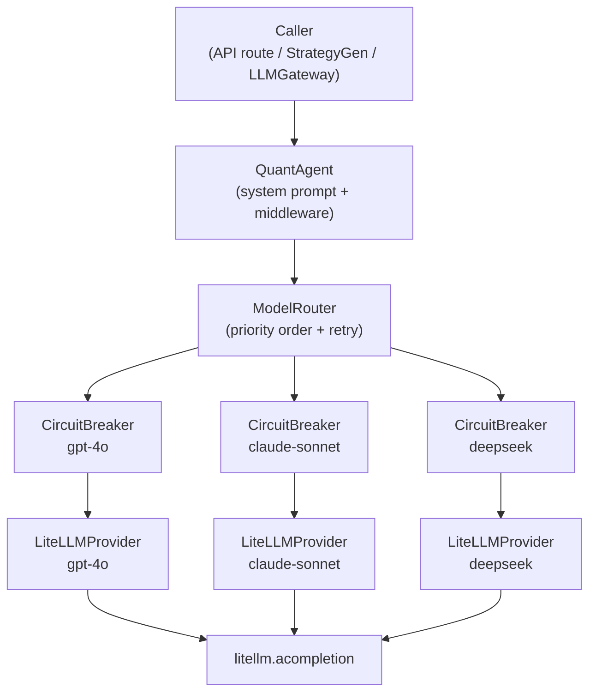

# LLM Agent Layer Implementation Plan

> **For agentic workers:** REQUIRED SUB-SKILL: Use superpowers:subagent-driven-development (recommended) or superpowers:executing-plans to implement this plan task-by-task. Steps use checkbox (`- [ ]`) syntax for tracking.

**Goal:** Refactor all LLM calls through a unified `QuantAgent` layer with priority-ordered multi-model fallback, per-model circuit breaker, exponential-backoff retry, middleware hooks, and TOML-driven config — while preserving full backwards compatibility.

**Architecture:** New `quantpilot.agent` package wraps LiteLLM; `ModelRouter` iterates models by priority, guarded by per-model `CircuitBreaker` (CLOSED→OPEN→HALF_OPEN). `QuantAgent` adds system prompt + middleware chain. Existing `LLMGateway` becomes a thin wrapper delegating plain chat/stream to the agent (tool-calling stays pinned to its single model). `StrategyGenerator` delegates to `QuantAgent`. API routes unchanged externally.

**Tech Stack:** Python 3.12, LiteLLM, Pydantic v2, `tomllib` (stdlib), `asyncio`, loguru, pytest-asyncio (asyncio_mode=auto)

---

## File Map

**Created:**
- `backend/src/quantpilot/agent/__init__.py` — re-exports: `QuantAgent`, `get_default_agent`, `ChatMessage`
- `backend/src/quantpilot/agent/_types.py` — error hierarchy, `CircuitState`, `ModelConfig`, `AgentConfig`, `ChatMessage`
- `backend/src/quantpilot/agent/circuit_breaker.py` — 3-state machine per model
- `backend/src/quantpilot/agent/provider.py` — `LiteLLMProvider` (chat + stream)
- `backend/src/quantpilot/agent/router.py` — `ModelRouter` (retry + fallback + circuit breaker)
- `backend/src/quantpilot/agent/middleware.py` — `Middleware` Protocol + `LoggingMiddleware`
- `backend/src/quantpilot/agent/agent.py` — `QuantAgent`, `get_default_agent` singleton
- `backend/config/llm_agents.toml` — TOML model registry
- `docs/llm-agent-layer-design.md` — architecture design doc
- `backend/tests/agent/__init__.py`
- `backend/tests/agent/test_types.py`
- `backend/tests/agent/test_circuit_breaker.py`
- `backend/tests/agent/test_router.py`
- `backend/tests/agent/test_agent.py`

**Modified:**
- `backend/src/quantpilot/llm/gateway.py` — delegates stream/plain-chat to QuantAgent; keeps tool-calling logic
- `backend/src/quantpilot/llm/strategy_gen.py` — delegates to QuantAgent instead of calling litellm directly

---

### Task 1: TOML Config + `_types.py`

**Files:**
- Create: `backend/config/llm_agents.toml`
- Create: `backend/src/quantpilot/agent/_types.py`
- Create: `backend/tests/agent/__init__.py`
- Create: `backend/tests/agent/test_types.py`

- [ ] **Step 1: Write the failing tests**

```python
# backend/tests/agent/test_types.py
"""Tests for agent type definitions and config loading."""
from __future__ import annotations

import tomllib
from pathlib import Path

import pytest

from quantpilot.agent._types import (
    AgentConfig,
    AgentError,
    AllModelsFailedError,
    ChatMessage,
    CircuitState,
    ModelConfig,
    ModelUnavailableError,
)


class TestErrors:
    def test_agent_error_is_exception(self) -> None:
        err = AgentError("test")
        assert isinstance(err, Exception)

    def test_model_unavailable_error_has_model_id(self) -> None:
        err = ModelUnavailableError("gpt-4o", "rate limited")
        assert err.model_id == "gpt-4o"
        assert "gpt-4o" in str(err)
        assert "rate limited" in str(err)

    def test_all_models_failed_error_lists_models(self) -> None:
        err = AllModelsFailedError({"gpt-4o": "timeout", "claude": "401"})
        assert "gpt-4o" in str(err)
        assert "claude" in str(err)


class TestCircuitState:
    def test_three_states_exist(self) -> None:
        assert CircuitState.CLOSED.value == "closed"
        assert CircuitState.OPEN.value == "open"
        assert CircuitState.HALF_OPEN.value == "half_open"


class TestModelConfig:
    def test_defaults(self) -> None:
        cfg = ModelConfig(id="gpt-4o", name="GPT-4o", provider="openai")
        assert cfg.priority == 1
        assert cfg.timeout == 30.0
        assert cfg.max_retries == 3
        assert cfg.retry_base_delay == 0.5
        assert cfg.retry_max_delay == 30.0
        assert cfg.circuit_breaker_threshold == 5
        assert cfg.circuit_breaker_recovery == 60.0


class TestAgentConfig:
    def test_from_toml_loads_models(self, tmp_path: Path) -> None:
        toml = tmp_path / "llm_agents.toml"
        toml.write_text(
            '[agent]\nretry_base_delay = 1.0\n\n'
            '[[models]]\nid = "gpt-4o"\nname = "GPT-4o"\nprovider = "openai"\npriority = 1\n'
            '[[models]]\nid = "claude-sonnet-4-6"\nname = "Claude"\nprovider = "anthropic"\npriority = 2\n',
            encoding="utf-8",
        )
        config = AgentConfig.from_toml(toml)
        assert len(config.models) == 2
        assert config.models[0].id == "gpt-4o"
        assert config.models[1].id == "claude-sonnet-4-6"

    def test_from_toml_agent_defaults_propagate(self, tmp_path: Path) -> None:
        toml = tmp_path / "llm_agents.toml"
        toml.write_text(
            '[agent]\nretry_base_delay = 2.0\n\n'
            '[[models]]\nid = "gpt-4o"\nname = "GPT-4o"\nprovider = "openai"\npriority = 1\n',
            encoding="utf-8",
        )
        config = AgentConfig.from_toml(toml)
        assert config.models[0].retry_base_delay == 2.0

    def test_from_toml_missing_file_returns_defaults(self, tmp_path: Path) -> None:
        config = AgentConfig.from_toml(tmp_path / "nonexistent.toml")
        assert len(config.models) > 0
        assert config.models[0].id == "gpt-4o"


class TestChatMessage:
    def test_user_message(self) -> None:
        msg = ChatMessage(role="user", content="hello")
        assert msg.role == "user"
        assert msg.content == "hello"
```

- [ ] **Step 2: Run to verify tests fail**

```bash
cd backend && uv run pytest tests/agent/test_types.py -v
```

Expected: `ModuleNotFoundError: No module named 'quantpilot.agent'`

- [ ] **Step 3: Create `backend/tests/agent/__init__.py`**

```python
```
(empty file)

- [ ] **Step 4: Create `backend/config/llm_agents.toml`**

```toml
# QuantPilot LLM Agent — Model Registry
# Models are tried in ascending priority order.
# Per-model values override [agent] defaults.

[agent]
retry_base_delay = 0.5         # seconds; exponential base
retry_max_delay = 30.0         # max wait between retries
circuit_breaker_threshold = 5  # consecutive failures before OPEN
circuit_breaker_recovery = 60.0  # seconds before HALF_OPEN probe

[[models]]
id = "gpt-4o"
name = "GPT-4o"
provider = "openai"
priority = 1
timeout = 30.0
max_retries = 3

[[models]]
id = "claude-sonnet-4-6"
name = "Claude Sonnet 4.6"
provider = "anthropic"
priority = 2
timeout = 45.0
max_retries = 2

[[models]]
id = "gpt-4o-mini"
name = "GPT-4o Mini"
provider = "openai"
priority = 3
timeout = 20.0
max_retries = 3

[[models]]
id = "deepseek/deepseek-chat"
name = "DeepSeek Chat"
provider = "openai"
priority = 4
timeout = 30.0
max_retries = 2
```

- [ ] **Step 5: Create `backend/src/quantpilot/agent/_types.py`**

```python
"""Agent layer shared types — error hierarchy, enums, config dataclasses."""
from __future__ import annotations

import tomllib
from dataclasses import dataclass, field
from enum import Enum
from pathlib import Path

from pydantic import BaseModel


# ── Error hierarchy ───────────────────────────────────────────────────────────


class AgentError(Exception):
    """Base error for the agent layer."""


class ModelUnavailableError(AgentError):
    """A specific model is unavailable (circuit open, timeout, API error)."""

    def __init__(self, model_id: str, reason: str) -> None:
        super().__init__(f"Model {model_id!r} unavailable: {reason}")
        self.model_id = model_id
        self.reason = reason


class AllModelsFailedError(AgentError):
    """All models in the fallback chain were exhausted."""

    def __init__(self, errors: dict[str, str]) -> None:
        lines = "\n".join(f"  {m}: {e}" for m, e in errors.items())
        super().__init__(f"All models failed:\n{lines}")
        self.errors = errors


# ── Circuit breaker state ─────────────────────────────────────────────────────


class CircuitState(Enum):
    """Health state of a model's circuit breaker."""

    CLOSED = "closed"      # Normal operation
    OPEN = "open"          # Requests blocked after too many failures
    HALF_OPEN = "half_open"  # One probe allowed to test recovery


# ── Config dataclasses ────────────────────────────────────────────────────────


@dataclass
class ModelConfig:
    """Configuration for a single model in the registry."""

    id: str
    name: str
    provider: str  # "openai" | "anthropic" | etc.
    priority: int = 1           # Lower = higher priority
    timeout: float = 30.0       # Seconds per request
    max_retries: int = 3        # Per-model retry attempts
    retry_base_delay: float = 0.5    # Exponential backoff base (seconds)
    retry_max_delay: float = 30.0    # Backoff cap (seconds)
    circuit_breaker_threshold: int = 5       # Failures before OPEN
    circuit_breaker_recovery: float = 60.0  # Seconds before HALF_OPEN


@dataclass
class AgentConfig:
    """Full agent configuration loaded from TOML."""

    models: list[ModelConfig] = field(default_factory=list)

    @classmethod
    def from_toml(cls, path: Path) -> "AgentConfig":
        """Load config from a TOML file; return defaults if file absent."""
        if not path.exists():
            return cls._default()
        with open(path, "rb") as f:
            data = tomllib.load(f)
        agent_defaults = data.get("agent", {})
        models: list[ModelConfig] = []
        for m in data.get("models", []):
            models.append(
                ModelConfig(
                    id=m["id"],
                    name=m.get("name", m["id"]),
                    provider=m.get("provider", "openai"),
                    priority=int(m.get("priority", 99)),
                    timeout=float(m.get("timeout", agent_defaults.get("timeout", 30.0))),
                    max_retries=int(m.get("max_retries", 3)),
                    retry_base_delay=float(
                        m.get("retry_base_delay", agent_defaults.get("retry_base_delay", 0.5))
                    ),
                    retry_max_delay=float(
                        m.get("retry_max_delay", agent_defaults.get("retry_max_delay", 30.0))
                    ),
                    circuit_breaker_threshold=int(
                        m.get(
                            "circuit_breaker_threshold",
                            agent_defaults.get("circuit_breaker_threshold", 5),
                        )
                    ),
                    circuit_breaker_recovery=float(
                        m.get(
                            "circuit_breaker_recovery",
                            agent_defaults.get("circuit_breaker_recovery", 60.0),
                        )
                    ),
                )
            )
        return cls(models=models)

    @classmethod
    def _default(cls) -> "AgentConfig":
        return cls(
            models=[
                ModelConfig(id="gpt-4o", name="GPT-4o", provider="openai", priority=1),
                ModelConfig(
                    id="claude-sonnet-4-6",
                    name="Claude Sonnet 4.6",
                    provider="anthropic",
                    priority=2,
                ),
                ModelConfig(
                    id="deepseek/deepseek-chat",
                    name="DeepSeek Chat",
                    provider="openai",
                    priority=3,
                ),
            ]
        )


# ── Chat message (shared with llm.gateway for compatibility) ──────────────────


class ChatMessage(BaseModel):
    """Chat message exchanged with the agent."""

    role: str    # "user" | "assistant" | "system"
    content: str
```

- [ ] **Step 6: Run tests again to verify they pass**

```bash
cd backend && uv run pytest tests/agent/test_types.py -v
```

Expected: all 11 tests PASS

- [ ] **Step 7: Commit**

```bash
cd backend && git add src/quantpilot/agent/_types.py tests/agent/__init__.py tests/agent/test_types.py ../config/llm_agents.toml
git commit -m "feat(agent): add _types.py and TOML config for LLM agent layer"
```

---

### Task 2: Circuit Breaker

**Files:**
- Create: `backend/src/quantpilot/agent/circuit_breaker.py`
- Create: `backend/tests/agent/test_circuit_breaker.py`

- [ ] **Step 1: Write failing tests**

```python
# backend/tests/agent/test_circuit_breaker.py
"""Tests for per-model circuit breaker state machine."""
from __future__ import annotations

import time

import pytest

from quantpilot.agent._types import CircuitState
from quantpilot.agent.circuit_breaker import CircuitBreaker


class TestCircuitBreakerInitial:
    def test_starts_closed(self) -> None:
        cb = CircuitBreaker("m1", threshold=3, recovery_seconds=60.0)
        assert cb.state == CircuitState.CLOSED

    def test_starts_available(self) -> None:
        cb = CircuitBreaker("m1", threshold=3, recovery_seconds=60.0)
        assert cb.is_available()


class TestCircuitBreakerFailures:
    async def test_below_threshold_stays_closed(self) -> None:
        cb = CircuitBreaker("m1", threshold=3, recovery_seconds=60.0)
        await cb.record_failure()
        await cb.record_failure()
        assert cb.state == CircuitState.CLOSED
        assert cb.is_available()

    async def test_opens_at_threshold(self) -> None:
        cb = CircuitBreaker("m1", threshold=3, recovery_seconds=60.0)
        for _ in range(3):
            await cb.record_failure()
        assert cb.state == CircuitState.OPEN
        assert not cb.is_available()

    async def test_success_resets_failure_count(self) -> None:
        cb = CircuitBreaker("m1", threshold=3, recovery_seconds=60.0)
        await cb.record_failure()
        await cb.record_failure()
        await cb.record_success()
        assert cb.state == CircuitState.CLOSED
        # After reset, needs threshold failures to open again
        await cb.record_failure()
        await cb.record_failure()
        assert cb.state == CircuitState.CLOSED  # still closed, not yet at threshold


class TestCircuitBreakerRecovery:
    async def test_open_transitions_to_half_open_after_recovery(self) -> None:
        cb = CircuitBreaker("m1", threshold=1, recovery_seconds=0.0)
        await cb.record_failure()
        assert cb.state == CircuitState.OPEN
        # With recovery_seconds=0, is_available() immediately probes
        assert cb.is_available()
        assert cb.state == CircuitState.HALF_OPEN

    async def test_open_stays_open_before_recovery(self) -> None:
        cb = CircuitBreaker("m1", threshold=1, recovery_seconds=9999.0)
        await cb.record_failure()
        assert not cb.is_available()
        assert cb.state == CircuitState.OPEN


class TestCircuitBreakerHalfOpen:
    async def test_half_open_success_closes(self) -> None:
        cb = CircuitBreaker("m1", threshold=1, recovery_seconds=0.0)
        await cb.record_failure()
        cb.is_available()  # → HALF_OPEN
        await cb.record_success()
        assert cb.state == CircuitState.CLOSED

    async def test_half_open_failure_reopens(self) -> None:
        cb = CircuitBreaker("m1", threshold=1, recovery_seconds=0.0)
        await cb.record_failure()
        cb.is_available()  # → HALF_OPEN
        await cb.record_failure()
        assert cb.state == CircuitState.OPEN

    async def test_half_open_is_available(self) -> None:
        cb = CircuitBreaker("m1", threshold=1, recovery_seconds=0.0)
        await cb.record_failure()
        cb.is_available()  # trigger transition
        assert cb.state == CircuitState.HALF_OPEN
        assert cb.is_available()  # HALF_OPEN allows probe
```

- [ ] **Step 2: Run to verify tests fail**

```bash
cd backend && uv run pytest tests/agent/test_circuit_breaker.py -v
```

Expected: `ModuleNotFoundError: No module named 'quantpilot.agent.circuit_breaker'`

- [ ] **Step 3: Implement `circuit_breaker.py`**

```python
# backend/src/quantpilot/agent/circuit_breaker.py
"""Per-model circuit breaker — CLOSED → OPEN → HALF_OPEN state machine."""
from __future__ import annotations

import asyncio
import time

from loguru import logger

from quantpilot.agent._types import CircuitState


class CircuitBreaker:
    """3-state circuit breaker for a single LLM model endpoint.

    State transitions:
      CLOSED  → OPEN      when failure_count >= threshold
      OPEN    → HALF_OPEN after recovery_seconds have elapsed
      HALF_OPEN → CLOSED  on next success
      HALF_OPEN → OPEN    on next failure
    """

    def __init__(
        self,
        model_id: str,
        threshold: int = 5,
        recovery_seconds: float = 60.0,
    ) -> None:
        self._model_id = model_id
        self._threshold = threshold
        self._recovery = recovery_seconds
        self._state = CircuitState.CLOSED
        self._failure_count = 0
        self._last_failure_time = 0.0
        self._lock = asyncio.Lock()

    @property
    def state(self) -> CircuitState:
        """Current circuit state (read without lock — eventual consistency ok)."""
        return self._state

    def is_available(self) -> bool:
        """Return True if a request should be allowed through.

        Side effect: transitions OPEN → HALF_OPEN when recovery period expires.
        """
        if self._state == CircuitState.CLOSED:
            return True
        if self._state == CircuitState.OPEN:
            elapsed = time.monotonic() - self._last_failure_time
            if elapsed >= self._recovery:
                self._state = CircuitState.HALF_OPEN
                logger.info(f"[CircuitBreaker] {self._model_id}: OPEN → HALF_OPEN (probe)")
                return True
            return False
        # HALF_OPEN: allow the probe
        return True

    async def record_success(self) -> None:
        """Record a successful response — resets failure count and closes circuit."""
        async with self._lock:
            if self._state != CircuitState.CLOSED:
                logger.info(
                    f"[CircuitBreaker] {self._model_id}: {self._state.value} → CLOSED"
                )
            self._failure_count = 0
            self._state = CircuitState.CLOSED

    async def record_failure(self) -> None:
        """Record a failed response — may open the circuit."""
        async with self._lock:
            self._failure_count += 1
            self._last_failure_time = time.monotonic()
            if self._state == CircuitState.HALF_OPEN or self._failure_count >= self._threshold:
                if self._state != CircuitState.OPEN:
                    logger.warning(
                        f"[CircuitBreaker] {self._model_id}: → OPEN "
                        f"(failures={self._failure_count})"
                    )
                self._state = CircuitState.OPEN
```

- [ ] **Step 4: Run tests to verify they pass**

```bash
cd backend && uv run pytest tests/agent/test_circuit_breaker.py -v
```

Expected: all 12 tests PASS

- [ ] **Step 5: Commit**

```bash
cd backend && git add src/quantpilot/agent/circuit_breaker.py tests/agent/test_circuit_breaker.py
git commit -m "feat(agent): add CircuitBreaker with CLOSED/OPEN/HALF_OPEN state machine"
```

---

### Task 3: Provider

**Files:**
- Create: `backend/src/quantpilot/agent/provider.py`

(Provider is tested indirectly through router tests; the real litellm is mocked there)

- [ ] **Step 1: Create `provider.py`**

```python
# backend/src/quantpilot/agent/provider.py
"""LiteLLM-backed model provider — chat and streaming."""
from __future__ import annotations

from collections.abc import AsyncIterator
from typing import Any

import litellm
from loguru import logger

litellm.drop_params = True  # ignore unsupported params per model


class LiteLLMProvider:
    """Thin async wrapper around litellm.acompletion for a single model.

    Responsible for a single model; no retry or fallback logic here.
    """

    def __init__(self, model_id: str, api_key: str = "") -> None:
        self._model = model_id
        self._api_key = api_key or None

    async def chat(
        self,
        messages: list[dict[str, Any]],
        *,
        timeout: float = 30.0,
        **kwargs: Any,
    ) -> str:
        """Non-streaming chat; returns the full response string."""
        response = await litellm.acompletion(
            model=self._model,
            messages=messages,
            api_key=self._api_key,
            timeout=timeout,
            **kwargs,
        )
        return str(response.choices[0].message.content or "")

    def stream(
        self,
        messages: list[dict[str, Any]],
        *,
        timeout: float = 30.0,
        **kwargs: Any,
    ) -> AsyncIterator[str]:
        """Return an async iterator that yields tokens as they arrive."""
        return self._stream_gen(messages, timeout=timeout, **kwargs)

    async def _stream_gen(
        self,
        messages: list[dict[str, Any]],
        *,
        timeout: float = 30.0,
        **kwargs: Any,
    ) -> AsyncIterator[str]:  # type: ignore[return]
        response = await litellm.acompletion(
            model=self._model,
            messages=messages,
            api_key=self._api_key,
            timeout=timeout,
            stream=True,
            **kwargs,
        )
        async for chunk in response:
            delta = chunk.choices[0].delta
            if hasattr(delta, "content") and delta.content:
                yield delta.content
```

- [ ] **Step 2: Verify it imports cleanly**

```bash
cd backend && uv run python -c "from quantpilot.agent.provider import LiteLLMProvider; print('ok')"
```

Expected: `ok`

- [ ] **Step 3: Commit**

```bash
cd backend && git add src/quantpilot/agent/provider.py
git commit -m "feat(agent): add LiteLLMProvider wrapping litellm.acompletion"
```

---

### Task 4: Router (retry + fallback + circuit breaker)

**Files:**
- Create: `backend/src/quantpilot/agent/router.py`
- Create: `backend/tests/agent/test_router.py`

- [ ] **Step 1: Write failing tests**

```python
# backend/tests/agent/test_router.py
"""Tests for ModelRouter — retry, fallback, and circuit breaker integration."""
from __future__ import annotations

from collections.abc import AsyncIterator
from unittest.mock import AsyncMock, MagicMock, patch

import pytest

from quantpilot.agent._types import AllModelsFailedError, ModelConfig, ModelUnavailableError
from quantpilot.agent.router import ModelRouter


def _cfg(model_id: str, priority: int = 1, max_retries: int = 1) -> ModelConfig:
    return ModelConfig(
        id=model_id,
        name=model_id,
        provider="openai",
        priority=priority,
        timeout=5.0,
        max_retries=max_retries,
        retry_base_delay=0.0,  # no sleep in tests
        circuit_breaker_threshold=3,
        circuit_breaker_recovery=9999.0,
    )


def _key_loader(provider: str) -> str | None:
    return "test-key"


def _mock_response(content: str) -> MagicMock:
    resp = MagicMock()
    resp.choices = [MagicMock()]
    resp.choices[0].message.content = content
    return resp


class TestModelRouterChat:
    async def test_uses_highest_priority_model_first(self) -> None:
        configs = [_cfg("m2", priority=2), _cfg("m1", priority=1)]
        called: list[str] = []

        async def mock_completion(**kwargs: object) -> MagicMock:
            called.append(str(kwargs["model"]))
            return _mock_response("ok")

        with patch("litellm.acompletion", side_effect=mock_completion):
            router = ModelRouter(configs, key_loader=_key_loader)
            await router.chat([{"role": "user", "content": "hi"}])

        assert called[0] == "m1"

    async def test_falls_back_when_primary_fails(self) -> None:
        configs = [_cfg("m1", priority=1, max_retries=1), _cfg("m2", priority=2)]

        async def mock_completion(**kwargs: object) -> MagicMock:
            if kwargs["model"] == "m1":
                raise RuntimeError("rate limited")
            return _mock_response("from m2")

        with patch("litellm.acompletion", side_effect=mock_completion):
            router = ModelRouter(configs, key_loader=_key_loader)
            result = await router.chat([{"role": "user", "content": "hi"}])

        assert result == "from m2"

    async def test_retries_before_fallback(self) -> None:
        configs = [_cfg("m1", priority=1, max_retries=3), _cfg("m2", priority=2)]
        call_count: dict[str, int] = {"m1": 0, "m2": 0}

        async def mock_completion(**kwargs: object) -> MagicMock:
            model = str(kwargs["model"])
            call_count[model] = call_count.get(model, 0) + 1
            if model == "m1":
                raise RuntimeError("error")
            return _mock_response("ok")

        with patch("litellm.acompletion", side_effect=mock_completion):
            router = ModelRouter(configs, key_loader=_key_loader)
            await router.chat([{"role": "user", "content": "hi"}])

        assert call_count["m1"] == 3  # 3 retries before fallback

    async def test_raises_all_models_failed_when_exhausted(self) -> None:
        configs = [_cfg("m1", max_retries=1)]

        async def mock_completion(**kwargs: object) -> MagicMock:
            raise RuntimeError("always fails")

        with patch("litellm.acompletion", side_effect=mock_completion):
            router = ModelRouter(configs, key_loader=_key_loader)
            with pytest.raises(AllModelsFailedError) as exc_info:
                await router.chat([{"role": "user", "content": "hi"}])
        assert "m1" in exc_info.value.errors

    async def test_skips_open_circuit(self) -> None:
        configs = [_cfg("m1", priority=1, max_retries=1), _cfg("m2", priority=2)]
        called: list[str] = []

        async def mock_completion(**kwargs: object) -> MagicMock:
            called.append(str(kwargs["model"]))
            return _mock_response("ok")

        with patch("litellm.acompletion", side_effect=mock_completion):
            router = ModelRouter(configs, key_loader=_key_loader)
            # Force m1 circuit open
            cb = router._circuit_breakers["m1"]
            for _ in range(3):
                await cb.record_failure()  # threshold=3 → OPEN

            await router.chat([{"role": "user", "content": "hi"}])

        assert "m1" not in called
        assert "m2" in called

    async def test_returns_correct_content(self) -> None:
        configs = [_cfg("m1")]

        with patch("litellm.acompletion", return_value=_mock_response("hello world")):
            router = ModelRouter(configs, key_loader=_key_loader)
            result = await router.chat([{"role": "user", "content": "hi"}])

        assert result == "hello world"


class TestModelRouterStream:
    async def test_stream_yields_tokens_from_primary(self) -> None:
        configs = [_cfg("m1")]

        async def token_gen() -> AsyncIterator[str]:
            for t in ["hello", " ", "world"]:
                yield t

        async def mock_completion(**kwargs: object) -> MagicMock:
            resp = MagicMock()
            resp.__aiter__ = MagicMock(
                return_value=iter([
                    MagicMock(choices=[MagicMock(delta=MagicMock(content="hello"))]),
                    MagicMock(choices=[MagicMock(delta=MagicMock(content=" world"))]),
                ])
            )
            return resp

        # Patch provider directly for streaming test
        with patch(
            "quantpilot.agent.provider.LiteLLMProvider._stream_gen",
            return_value=token_gen(),
        ):
            router = ModelRouter(configs, key_loader=_key_loader)
            tokens = []
            async for token in router.stream([{"role": "user", "content": "hi"}]):
                tokens.append(token)

        assert tokens == ["hello", " ", "world"]

    async def test_stream_falls_back_on_connection_error(self) -> None:
        configs = [_cfg("m1", priority=1, max_retries=1), _cfg("m2", priority=2)]
        called: list[str] = []

        async def good_gen() -> AsyncIterator[str]:
            yield "fallback token"

        original_stream = None

        def patched_stream(self_: object, messages: object, *, timeout: float, **kw: object) -> AsyncIterator[str]:
            model = getattr(self_, "_model", "?")
            called.append(model)
            if model == "m1":
                raise RuntimeError("connection refused")
            return good_gen()

        with patch("quantpilot.agent.provider.LiteLLMProvider.stream", patched_stream):
            router = ModelRouter(configs, key_loader=_key_loader)
            tokens = []
            async for token in router.stream([{"role": "user", "content": "hi"}]):
                tokens.append(token)

        assert "m1" in called
        assert "m2" in called
        assert tokens == ["fallback token"]
```

- [ ] **Step 2: Run to verify tests fail**

```bash
cd backend && uv run pytest tests/agent/test_router.py -v
```

Expected: `ModuleNotFoundError: No module named 'quantpilot.agent.router'`

- [ ] **Step 3: Implement `router.py`**

```python
# backend/src/quantpilot/agent/router.py
"""ModelRouter — priority-ordered fallback with per-model retry and circuit breaker."""
from __future__ import annotations

import asyncio
from collections.abc import AsyncIterator, Callable
from typing import Any

from loguru import logger

from quantpilot.agent._types import (
    AllModelsFailedError,
    ModelConfig,
    ModelUnavailableError,
)
from quantpilot.agent.circuit_breaker import CircuitBreaker
from quantpilot.agent.provider import LiteLLMProvider


class ModelRouter:
    """Routes LLM requests across a priority-ordered model list.

    For each request:
      1. Iterate models by ascending priority, skip models with open circuits.
      2. Per model: retry up to max_retries with exponential backoff.
      3. On success: record_success, return result.
      4. On all retries exhausted: record_failure, try next model.
      5. If all models fail: raise AllModelsFailedError.
    """

    def __init__(
        self,
        configs: list[ModelConfig],
        key_loader: Callable[[str], str | None],
    ) -> None:
        self._configs = sorted(configs, key=lambda m: m.priority)
        self._key_loader = key_loader
        self._circuit_breakers: dict[str, CircuitBreaker] = {
            cfg.id: CircuitBreaker(
                cfg.id,
                threshold=cfg.circuit_breaker_threshold,
                recovery_seconds=cfg.circuit_breaker_recovery,
            )
            for cfg in configs
        }

    def _make_provider(self, cfg: ModelConfig) -> LiteLLMProvider:
        api_key = self._key_loader(cfg.provider) or ""
        return LiteLLMProvider(cfg.id, api_key)

    async def _try_chat_with_retry(
        self,
        cfg: ModelConfig,
        messages: list[dict[str, Any]],
    ) -> str:
        """Attempt chat for one model with exponential-backoff retries.

        Raises ModelUnavailableError if all retries exhausted or circuit open.
        """
        cb = self._circuit_breakers[cfg.id]
        if not cb.is_available():
            raise ModelUnavailableError(cfg.id, "circuit open")

        last_error: Exception | None = None
        for attempt in range(cfg.max_retries):
            if attempt > 0:
                delay = min(
                    cfg.retry_base_delay * (2 ** (attempt - 1)),
                    cfg.retry_max_delay,
                )
                if delay > 0:
                    await asyncio.sleep(delay)
            try:
                provider = self._make_provider(cfg)
                result = await provider.chat(messages, timeout=cfg.timeout)
                await cb.record_success()
                return result
            except Exception as exc:
                last_error = exc
                logger.debug(
                    f"[Router] {cfg.id} attempt {attempt + 1}/{cfg.max_retries} failed: {exc}"
                )

        await cb.record_failure()
        raise ModelUnavailableError(cfg.id, str(last_error)) from last_error

    async def chat(self, messages: list[dict[str, Any]]) -> str:
        """Chat with automatic fallback across models."""
        errors: dict[str, str] = {}
        for cfg in self._configs:
            try:
                return await self._try_chat_with_retry(cfg, messages)
            except ModelUnavailableError as exc:
                errors[cfg.id] = exc.reason
                logger.warning(f"[Router] {cfg.id} unavailable, trying next model")
        raise AllModelsFailedError(errors)

    async def stream(self, messages: list[dict[str, Any]]) -> AsyncIterator[str]:
        """Stream tokens with automatic fallback across models.

        Tries to get the first token from each model before committing.
        Falls back to next model if connection fails.
        """
        errors: dict[str, str] = {}
        for cfg in self._configs:
            cb = self._circuit_breakers[cfg.id]
            if not cb.is_available():
                errors[cfg.id] = "circuit open"
                continue

            try:
                provider = self._make_provider(cfg)
                gen = provider.stream(messages, timeout=cfg.timeout)
                # Attempt to get first token — validates the connection
                try:
                    first = await asyncio.wait_for(gen.__anext__(), timeout=cfg.timeout)
                except StopAsyncIteration:
                    # Empty stream — still a success
                    await cb.record_success()
                    return
            except Exception as exc:
                await cb.record_failure()
                errors[cfg.id] = str(exc)
                logger.warning(f"[Router] stream {cfg.id} failed: {exc}, trying next")
                continue

            # First token succeeded — commit to this model
            await cb.record_success()
            yield first
            async for token in gen:
                yield token
            return

        raise AllModelsFailedError(errors)
```

- [ ] **Step 4: Run tests to verify they pass**

```bash
cd backend && uv run pytest tests/agent/test_router.py -v
```

Expected: all tests PASS

- [ ] **Step 5: Commit**

```bash
cd backend && git add src/quantpilot/agent/router.py tests/agent/test_router.py
git commit -m "feat(agent): add ModelRouter with retry, fallback, and circuit breaker"
```

---

### Task 5: Middleware

**Files:**
- Create: `backend/src/quantpilot/agent/middleware.py`

- [ ] **Step 1: Create `middleware.py`**

```python
# backend/src/quantpilot/agent/middleware.py
"""Middleware protocol and built-in implementations."""
from __future__ import annotations

import time
from typing import Any, Protocol, runtime_checkable

from loguru import logger


@runtime_checkable
class Middleware(Protocol):
    """Hook interface called around every agent request.

    Extension point: implement this protocol to add RAG, tracing, auth, etc.
    All methods are async; implementations may be no-ops.
    """

    async def before_request(
        self,
        messages: list[dict[str, Any]],
        context: dict[str, Any],
    ) -> None:
        """Called before the LLM request is dispatched.

        Args:
            messages: Full message list (system prompt + history).
            context: Mutable dict shared across all hooks for this request.
        """

    async def after_response(
        self,
        response: str,
        context: dict[str, Any],
    ) -> str:
        """Called after a successful response.

        Returns the (possibly modified) response string.
        """
        ...

    async def on_error(
        self,
        error: Exception,
        context: dict[str, Any],
    ) -> None:
        """Called when the router raises an error (after all fallbacks exhausted)."""


class LoggingMiddleware:
    """Logs request/response metadata at INFO level."""

    async def before_request(
        self,
        messages: list[dict[str, Any]],
        context: dict[str, Any],
    ) -> None:
        context["_start_time"] = time.monotonic()
        logger.info(f"[Agent] request: {len(messages)} messages")

    async def after_response(
        self,
        response: str,
        context: dict[str, Any],
    ) -> str:
        elapsed = time.monotonic() - context.get("_start_time", time.monotonic())
        logger.info(
            f"[Agent] response: {len(response)} chars in {elapsed:.2f}s"
        )
        return response

    async def on_error(
        self,
        error: Exception,
        context: dict[str, Any],
    ) -> None:
        logger.error(f"[Agent] error: {error}")
```

- [ ] **Step 2: Verify it imports cleanly**

```bash
cd backend && uv run python -c "from quantpilot.agent.middleware import LoggingMiddleware, Middleware; print('ok')"
```

Expected: `ok`

- [ ] **Step 3: Commit**

```bash
cd backend && git add src/quantpilot/agent/middleware.py
git commit -m "feat(agent): add Middleware protocol and LoggingMiddleware"
```

---

### Task 6: QuantAgent + `__init__.py`

**Files:**
- Create: `backend/src/quantpilot/agent/agent.py`
- Create: `backend/src/quantpilot/agent/__init__.py`
- Create: `backend/tests/agent/test_agent.py`

- [ ] **Step 1: Write failing tests**

```python
# backend/tests/agent/test_agent.py
"""Tests for QuantAgent — middleware hooks, chat/stream delegation, singleton."""
from __future__ import annotations

from collections.abc import AsyncIterator
from unittest.mock import AsyncMock, MagicMock, patch

import pytest

from quantpilot.agent._types import AllModelsFailedError, ChatMessage, ModelConfig
from quantpilot.agent.agent import QuantAgent, get_default_agent
from quantpilot.agent.middleware import LoggingMiddleware
from quantpilot.agent.router import ModelRouter


def _make_router_with_response(content: str) -> ModelRouter:
    cfg = ModelConfig(
        id="gpt-4o",
        name="GPT-4o",
        provider="openai",
        priority=1,
        timeout=5.0,
        max_retries=1,
        retry_base_delay=0.0,
        circuit_breaker_threshold=3,
        circuit_breaker_recovery=9999.0,
    )
    router = ModelRouter([cfg], key_loader=lambda p: "test-key")

    mock_resp = MagicMock()
    mock_resp.choices = [MagicMock()]
    mock_resp.choices[0].message.content = content

    router._make_provider = MagicMock()  # type: ignore[method-assign]
    provider = MagicMock()
    provider.chat = AsyncMock(return_value=content)
    router._make_provider.return_value = provider
    return router


class TestQuantAgentChat:
    async def test_chat_returns_string(self) -> None:
        router = _make_router_with_response("hello from agent")
        agent = QuantAgent(router=router, middlewares=[])
        result = await agent.chat([ChatMessage(role="user", content="hi")])
        assert result == "hello from agent"

    async def test_chat_prepends_system_prompt(self) -> None:
        router = _make_router_with_response("ok")
        captured: list[list[dict[str, object]]] = []

        original_chat = router.chat

        async def capture_chat(messages: list[dict[str, object]]) -> str:
            captured.append(messages)
            return await original_chat(messages)

        router.chat = capture_chat  # type: ignore[method-assign]
        agent = QuantAgent(router=router, middlewares=[])
        await agent.chat([ChatMessage(role="user", content="hi")])

        assert captured[0][0]["role"] == "system"

    async def test_chat_raises_on_empty_history(self) -> None:
        router = _make_router_with_response("ok")
        agent = QuantAgent(router=router, middlewares=[])
        with pytest.raises(ValueError, match="消息列表"):
            await agent.chat([])

    async def test_middleware_before_after_called(self) -> None:
        router = _make_router_with_response("resp")
        before_called = []
        after_called = []

        class TrackingMiddleware:
            async def before_request(
                self, messages: list[dict[str, object]], context: dict[str, object]
            ) -> None:
                before_called.append(True)

            async def after_response(
                self, response: str, context: dict[str, object]
            ) -> str:
                after_called.append(response)
                return response

            async def on_error(
                self, error: Exception, context: dict[str, object]
            ) -> None:
                pass

        agent = QuantAgent(router=router, middlewares=[TrackingMiddleware()])
        await agent.chat([ChatMessage(role="user", content="hi")])

        assert before_called == [True]
        assert after_called == ["resp"]

    async def test_on_error_called_when_router_fails(self) -> None:
        cfg = ModelConfig(
            id="bad", name="bad", provider="openai", priority=1,
            max_retries=1, retry_base_delay=0.0,
            circuit_breaker_threshold=3, circuit_breaker_recovery=9999.0,
        )
        router = ModelRouter([cfg], key_loader=lambda p: "k")
        # All calls fail
        router._make_provider = MagicMock()  # type: ignore[method-assign]
        provider = MagicMock()
        provider.chat = AsyncMock(side_effect=RuntimeError("boom"))
        router._make_provider.return_value = provider

        error_caught: list[Exception] = []

        class ErrorMiddleware:
            async def before_request(self, *_: object, **__: object) -> None:
                pass

            async def after_response(self, response: str, *_: object, **__: object) -> str:
                return response

            async def on_error(self, error: Exception, *_: object, **__: object) -> None:
                error_caught.append(error)

        agent = QuantAgent(router=router, middlewares=[ErrorMiddleware()])
        with pytest.raises(AllModelsFailedError):
            await agent.chat([ChatMessage(role="user", content="hi")])

        assert len(error_caught) == 1


class TestQuantAgentStream:
    async def test_stream_yields_tokens(self) -> None:
        async def fake_stream(messages: list[dict[str, object]]) -> AsyncIterator[str]:
            for t in ["a", "b", "c"]:
                yield t

        cfg = ModelConfig(
            id="m1", name="m1", provider="openai", priority=1,
            max_retries=1, retry_base_delay=0.0,
            circuit_breaker_threshold=3, circuit_breaker_recovery=9999.0,
        )
        router = ModelRouter([cfg], key_loader=lambda p: "k")
        router.stream = fake_stream  # type: ignore[method-assign]

        agent = QuantAgent(router=router, middlewares=[])
        tokens = []
        async for t in agent.stream([ChatMessage(role="user", content="hi")]):
            tokens.append(t)

        assert tokens == ["a", "b", "c"]

    async def test_stream_raises_on_empty_history(self) -> None:
        router = _make_router_with_response("ok")
        agent = QuantAgent(router=router, middlewares=[])
        with pytest.raises(ValueError, match="消息列表"):
            async for _ in agent.stream([]):
                pass


class TestGetDefaultAgent:
    def test_returns_quant_agent_instance(self) -> None:
        # Reset singleton for test isolation
        import quantpilot.agent.agent as agent_module
        agent_module._DEFAULT_AGENT = None

        with patch("quantpilot.agent.agent._find_config_path", return_value=None.__class__()):
            # _find_config_path returns a nonexistent path → AgentConfig._default() used
            agent = get_default_agent()
            assert isinstance(agent, QuantAgent)

    def test_returns_same_instance_on_second_call(self) -> None:
        import quantpilot.agent.agent as agent_module
        agent_module._DEFAULT_AGENT = None

        with patch("quantpilot.agent.agent._find_config_path", return_value=None.__class__()):
            a1 = get_default_agent()
            a2 = get_default_agent()
            assert a1 is a2
```

- [ ] **Step 2: Run to verify tests fail**

```bash
cd backend && uv run pytest tests/agent/test_agent.py -v
```

Expected: `ModuleNotFoundError: No module named 'quantpilot.agent.agent'`

- [ ] **Step 3: Implement `agent.py`**

```python
# backend/src/quantpilot/agent/agent.py
"""QuantAgent — unified LLM interface with middleware, system prompt, and singleton factory."""
from __future__ import annotations

from collections.abc import AsyncIterator
from pathlib import Path
from typing import Any

from loguru import logger

from quantpilot.agent._types import AgentConfig, ChatMessage
from quantpilot.agent.middleware import LoggingMiddleware, Middleware
from quantpilot.agent.router import ModelRouter

# Re-used from gateway.py to keep the same persona
SYSTEM_PROMPT = """你是 QuantPilot 的 AI 量化分析助手，具备以下能力：
- 分析股票/加密货币技术面（K线形态、技术指标）
- 解读基本面数据和财务指标
- 提供策略建议和风险分析
- 调用工具查询实时数据

请用简洁专业的中文回答。数据分析时先调用工具获取实际数据，再给出分析。"""

_DEFAULT_AGENT: QuantAgent | None = None


class QuantAgent:
    """Primary LLM interface for QuantPilot.

    Wraps ModelRouter with:
    - System prompt injection
    - Middleware chain (before_request / after_response / on_error)
    - Extension stubs: rag_retriever, tool_executor, memory_store (Protocol-ready)
    """

    def __init__(
        self,
        router: ModelRouter,
        middlewares: list[Middleware] | None = None,
        system_prompt: str = SYSTEM_PROMPT,
    ) -> None:
        self._router = router
        self._middlewares: list[Middleware] = (
            middlewares if middlewares is not None else [LoggingMiddleware()]
        )
        self._system_prompt = system_prompt

    def _build_messages(self, history: list[ChatMessage]) -> list[dict[str, Any]]:
        msgs: list[dict[str, Any]] = [{"role": "system", "content": self._system_prompt}]
        msgs.extend({"role": m.role, "content": m.content} for m in history)
        return msgs

    async def chat(self, history: list[ChatMessage]) -> str:
        """Non-streaming chat with fallback and middleware hooks."""
        if not history:
            raise ValueError("消息列表不能为空")

        messages = self._build_messages(history)
        context: dict[str, Any] = {}

        for mw in self._middlewares:
            await mw.before_request(messages, context)

        try:
            result = await self._router.chat(messages)
        except Exception as exc:
            for mw in self._middlewares:
                await mw.on_error(exc, context)
            raise

        for mw in self._middlewares:
            result = await mw.after_response(result, context)

        return result

    async def stream(self, history: list[ChatMessage]) -> AsyncIterator[str]:
        """Streaming chat with fallback and error middleware hook."""
        if not history:
            raise ValueError("消息列表不能为空")

        messages = self._build_messages(history)
        context: dict[str, Any] = {}

        for mw in self._middlewares:
            await mw.before_request(messages, context)

        try:
            async for token in self._router.stream(messages):
                yield token
        except Exception as exc:
            for mw in self._middlewares:
                await mw.on_error(exc, context)
            yield f"[错误] {exc}"


def _find_config_path() -> Path:
    """Locate llm_agents.toml relative to cwd or package root."""
    candidates = [
        Path("config/llm_agents.toml"),
        Path(__file__).parent.parent.parent.parent / "config" / "llm_agents.toml",
    ]
    for p in candidates:
        if p.exists():
            return p
    return Path("config/llm_agents.toml")  # will trigger _default() in AgentConfig.from_toml


def _make_key_loader():
    """Return a function that loads API keys from keystore."""
    def load_key(provider: str) -> str | None:
        try:
            from quantpilot.security.keystore import load_api_key
            return load_api_key(provider)
        except Exception:
            return None
    return load_key


def get_default_agent() -> QuantAgent:
    """Return the process-level QuantAgent singleton, creating it if needed."""
    global _DEFAULT_AGENT
    if _DEFAULT_AGENT is None:
        config = AgentConfig.from_toml(_find_config_path())
        router = ModelRouter(config.models, key_loader=_make_key_loader())
        _DEFAULT_AGENT = QuantAgent(router=router)
        logger.info(
            f"[Agent] initialized with {len(config.models)} models: "
            + ", ".join(m.id for m in config.models)
        )
    return _DEFAULT_AGENT
```

- [ ] **Step 4: Create `__init__.py`**

```python
# backend/src/quantpilot/agent/__init__.py
"""QuantPilot unified LLM agent layer.

Usage:
    from quantpilot.agent import get_default_agent, ChatMessage

    agent = get_default_agent()
    reply = await agent.chat([ChatMessage(role="user", content="hi")])
"""
from quantpilot.agent._types import ChatMessage
from quantpilot.agent.agent import QuantAgent, get_default_agent

__all__ = ["QuantAgent", "get_default_agent", "ChatMessage"]
```

- [ ] **Step 5: Run tests**

```bash
cd backend && uv run pytest tests/agent/test_agent.py -v
```

Expected: all tests PASS

- [ ] **Step 6: Run all agent tests together**

```bash
cd backend && uv run pytest tests/agent/ -v
```

Expected: all tests PASS

- [ ] **Step 7: Commit**

```bash
cd backend && git add src/quantpilot/agent/agent.py src/quantpilot/agent/__init__.py tests/agent/test_agent.py
git commit -m "feat(agent): add QuantAgent with middleware hooks and get_default_agent singleton"
```

---

### Task 7: Design Doc

**Files:**
- Create: `docs/llm-agent-layer-design.md`

- [ ] **Step 1: Create design doc**

```markdown
# LLM Agent Layer — Architecture Design

## Overview

All LLM calls in QuantPilot route through `QuantAgent` (`quantpilot.agent`).
The agent layer provides multi-model fallback, per-model circuit breaker,
exponential-backoff retry, and a middleware hook system.

## Architecture



## Components

### `QuantAgent`

- Entry point for all callers
- Injects system prompt (`SYSTEM_PROMPT`) as the first message
- Runs `Middleware` chain: `before_request` → router → `after_response`
- On error: calls `on_error` hooks, then re-raises (or yields `[错误]` token for streams)

### `ModelRouter`

- Sorts models by `priority` (ascending); lower = tried first
- Per model: up to `max_retries` attempts, backoff = `min(base * 2^(attempt-1), max_delay)`
- After all retries fail: calls `CircuitBreaker.record_failure()`
- Falls back to next model; raises `AllModelsFailedError` if all exhausted

### `CircuitBreaker` (per model)

| State | Meaning | Transitions |
|---|---|---|
| CLOSED | Normal | → OPEN when failures ≥ threshold |
| OPEN | Blocked | → HALF_OPEN after recovery_seconds |
| HALF_OPEN | Probing | → CLOSED on success, → OPEN on failure |

### `LiteLLMProvider`

- Thin `litellm.acompletion` wrapper for one model
- No retry logic; retry is in `ModelRouter`
- `stream()` returns an `AsyncIterator[str]`; router peeks first token before committing

### `Middleware` (Protocol)

```python
class Middleware(Protocol):
    async def before_request(self, messages, context) -> None: ...
    async def after_response(self, response: str, context) -> str: ...
    async def on_error(self, error: Exception, context) -> None: ...
```

Built-in: `LoggingMiddleware` — logs request size and response latency.

Custom middleware examples:
- RAG: in `before_request`, retrieve relevant docs and inject into messages
- Token tracking: in `after_response`, count tokens and write to metrics DB
- Auth: in `before_request`, verify caller has LLM quota

### Config (`backend/config/llm_agents.toml`)

```toml
[agent]
retry_base_delay = 0.5
circuit_breaker_threshold = 5

[[models]]
id = "gpt-4o"
priority = 1
```

`AgentConfig.from_toml(path)` merges `[agent]` defaults into each `[[models]]` entry.

## Extension Points (stub protocols)

These are not implemented but the architecture reserves space:

- **RAG**: `before_request` middleware fetches relevant chunks via embeddings and injects into messages
- **Tool Calling**: stays in `LLMGateway.chat(use_tools=True)` — requires pinned model for `tool_call_id` continuity
- **Memory**: `after_response` middleware persists conversation summaries; `before_request` injects them

## Backwards Compatibility

- `LLMGateway.chat(use_tools=False)` delegates to `QuantAgent.chat()`
- `LLMGateway.stream()` delegates to `QuantAgent.stream()`
- `LLMGateway.chat(use_tools=True)` keeps existing litellm tool-calling logic (pinned model)
- `StrategyGenerator.generate()` delegates to `QuantAgent.chat()`
- All existing tests pass unchanged

## Fallback Flow Example

```
Request → gpt-4o (attempt 1: rate limited, attempt 2: rate limited, attempt 3: rate limited)
       → gpt-4o circuit opens
       → claude-sonnet (attempt 1: success) ✓
```
```

- [ ] **Step 2: Write to disk (save the content above as the file)**

File path: `docs/llm-agent-layer-design.md`

- [ ] **Step 3: Commit**

```bash
git add docs/llm-agent-layer-design.md
git commit -m "docs: add LLM agent layer architecture design doc"
```

---

### Task 8: Migrate `gateway.py`

**Files:**
- Modify: `backend/src/quantpilot/llm/gateway.py`

Goal: `stream()` and plain `chat(use_tools=False)` delegate to QuantAgent. Tool-calling `chat(use_tools=True)` is unchanged.

- [ ] **Step 1: Read existing tests to understand what must not break**

```bash
cd backend && uv run pytest tests/test_llm.py -v
```

Expected: all existing tests PASS (run this before any changes as a baseline)

- [ ] **Step 2: Update `gateway.py`**

Replace the file with:

```python
"""LLM 网关 — 保持 API 兼容，plain chat/stream 委托给 QuantAgent."""
from __future__ import annotations

import json
from collections.abc import AsyncIterator
from typing import Any

import litellm
from loguru import logger
from pydantic import BaseModel

from quantpilot.llm.tools import execute_tool, get_tool_definitions

litellm.drop_params = True

SYSTEM_PROMPT = """你是 QuantPilot 的 AI 量化分析助手，具备以下能力：
- 分析股票/加密货币技术面（K线形态、技术指标）
- 解读基本面数据和财务指标
- 提供策略建议和风险分析
- 调用工具查询实时数据

请用简洁专业的中文回答。数据分析时先调用工具获取实际数据，再给出分析。"""


class ChatMessage(BaseModel):
    """聊天消息模型（向后兼容 re-export）."""

    role: str
    content: str


class LLMGateway:
    """LLM 网关 — tool calling 使用固定模型；plain chat/stream 委托给 QuantAgent."""

    def __init__(self, model: str = "gpt-4o", api_key: str = "") -> None:
        self._model = model
        self._api_key = api_key

    @property
    def api_key(self) -> str:
        """公开访问 API key."""
        return self._api_key

    def _build_messages(self, history: list[ChatMessage]) -> list[dict[str, str]]:
        msgs: list[dict[str, str]] = [{"role": "system", "content": SYSTEM_PROMPT}]
        msgs.extend({"role": m.role, "content": m.content} for m in history)
        return msgs

    async def chat(self, history: list[ChatMessage], use_tools: bool = True) -> str:
        """非流式聊天.

        use_tools=True: 保留原有 Function Calling 逻辑（固定模型，支持 tool_call_id）.
        use_tools=False: 委托给 QuantAgent，享有多模型 fallback.
        """
        if not history:
            raise ValueError("消息列表不能为空")

        if not use_tools:
            from quantpilot.agent import ChatMessage as AgentMsg
            from quantpilot.agent import get_default_agent
            agent = get_default_agent()
            return await agent.chat([AgentMsg(role=m.role, content=m.content) for m in history])

        return await self._chat_with_tools(history)

    async def _chat_with_tools(self, history: list[ChatMessage]) -> str:
        """原有 Function Calling 逻辑 — 固定模型，支持多轮 tool_call_id."""
        messages = self._build_messages(history)
        kwargs: dict[str, Any] = {
            "model": self._model,
            "messages": messages,
            "api_key": self._api_key or None,
            "tools": get_tool_definitions(),
            "tool_choice": "auto",
        }

        try:
            response = await litellm.acompletion(**kwargs)
            msg = response.choices[0].message

            if hasattr(msg, "tool_calls") and msg.tool_calls:
                tool_results = []
                for tc in msg.tool_calls:
                    fn_name = tc.function.name
                    try:
                        args = json.loads(tc.function.arguments)
                    except json.JSONDecodeError:
                        args = {}
                    result = await execute_tool(fn_name, args)
                    tool_results.append(result)
                    logger.info(f"[LLM] tool call: {fn_name}({args}) → {result[:100]}")

                messages.append({"role": "assistant", "content": msg.content or ""})
                for i, tc in enumerate(msg.tool_calls):
                    messages.append(
                        {"role": "tool", "tool_call_id": tc.id, "content": tool_results[i]}
                    )
                follow_up = await litellm.acompletion(
                    model=self._model, messages=messages, api_key=self._api_key or None
                )
                return follow_up.choices[0].message.content or ""

            return msg.content or ""
        except Exception as e:
            logger.error(f"[LLM] chat error: {e}")
            raise

    async def stream(self, history: list[ChatMessage]) -> AsyncIterator[str]:
        """流式聊天 — 委托给 QuantAgent，享有多模型 fallback."""
        if not history:
            raise ValueError("消息列表不能为空")
        from quantpilot.agent import ChatMessage as AgentMsg
        from quantpilot.agent import get_default_agent
        agent = get_default_agent()
        async for token in agent.stream(
            [AgentMsg(role=m.role, content=m.content) for m in history]
        ):
            yield token
```

- [ ] **Step 3: Run existing LLM tests to verify no regressions**

```bash
cd backend && uv run pytest tests/test_llm.py -v
```

Expected: all existing tests PASS

- [ ] **Step 4: Commit**

```bash
cd backend && git add src/quantpilot/llm/gateway.py
git commit -m "refactor(llm): gateway delegates plain chat/stream to QuantAgent"
```

---

### Task 9: Migrate `strategy_gen.py`

**Files:**
- Modify: `backend/src/quantpilot/llm/strategy_gen.py`

- [ ] **Step 1: Run existing tests as baseline**

```bash
cd backend && uv run pytest tests/test_llm_strategy_gen.py -v
```

Expected: all tests PASS (baseline)

- [ ] **Step 2: Update `strategy_gen.py`**

Replace `generate()` to delegate to QuantAgent. `_parse_response()` and `StrategyGenResult` are unchanged.

```python
"""LLM 驱动策略代码生成器 — T-3.1."""
from __future__ import annotations

import re

from loguru import logger
from pydantic import BaseModel

STRATEGY_TEMPLATE = '''
你是一位量化策略专家，请根据用户描述生成完整的 QuantPilot 策略 Python 代码。

## 策略基类接口

```python
from quantpilot.strategy.base import BaseStrategy, StrategyContext
from quantpilot.data.models import OHLCVBar

class MyStrategy(BaseStrategy):
    name = "my_strategy"           # 唯一标识
    description = "策略说明"

    def on_init(self, context: StrategyContext) -> None:
        """初始化，设置参数."""
        pass

    def on_bar(self, bar: OHLCVBar, context: StrategyContext) -> None:
        """每根K线触发. 通过 context.buy/sell 下单."""
        # 买入示例: context.buy(bar.symbol, quantity=100, price=bar.close)
        # 卖出示例: context.sell(bar.symbol, quantity=100, price=bar.close)
        pass
```

## 要求
1. 生成完整可运行的策略类（继承 BaseStrategy）
2. 代码包含在 ```python ... ``` 代码块中
3. 之后一行写：EXPLANATION: <一句话解释策略逻辑>
4. 最后一行写：NAME: <策略英文名>

## 用户需求
{description}
'''


class StrategyGenResult(BaseModel):
    """LLM 策略生成结果."""

    code: str
    explanation: str
    name: str


class StrategyGenerator:
    """基于 LLM 将自然语言描述转换为可执行 Python 策略代码."""

    def __init__(self, model: str = "gpt-4o", api_key: str = "") -> None:
        # model/api_key kept for backwards compatibility; QuantAgent uses its own config
        self._model = model
        self._api_key = api_key

    async def generate(self, description: str) -> StrategyGenResult:
        """根据自然语言描述生成策略代码，委托给 QuantAgent."""
        if not description.strip():
            raise ValueError("描述不能为空")

        prompt = STRATEGY_TEMPLATE.format(description=description.strip())

        from quantpilot.agent import ChatMessage, get_default_agent
        agent = get_default_agent()
        try:
            raw = await agent.chat([ChatMessage(role="user", content=prompt)])
            logger.info(f"[StrategyGen] generated {len(raw)} chars for: {description[:50]}")
            return self._parse_response(raw, description)
        except Exception as e:
            logger.error(f"[StrategyGen] error: {e}")
            raise

    def _parse_response(self, raw: str, description: str) -> StrategyGenResult:
        """从 LLM 响应中提取代码、解释和名称."""
        code_match = re.search(r"```python\s*(.*?)```", raw, re.DOTALL)
        if code_match:
            code = code_match.group(1).strip()
        else:
            code = raw.split("EXPLANATION:")[0].strip()

        expl_match = re.search(r"EXPLANATION:\s*(.+?)(?:\n|$)", raw)
        explanation = expl_match.group(1).strip() if expl_match else description[:80]

        name_match = re.search(r"NAME:\s*(.+?)(?:\n|$)", raw)
        name = name_match.group(1).strip() if name_match else "GeneratedStrategy"

        return StrategyGenResult(code=code, explanation=explanation, name=name)
```

- [ ] **Step 3: Update `test_llm_strategy_gen.py` — patch QuantAgent instead of litellm**

The test currently patches `litellm.acompletion`. After the migration, `StrategyGenerator` calls `agent.chat()`. We need to patch at the agent level.

```python
# In test_llm_strategy_gen.py, update test_generate_returns_result:
async def test_generate_returns_result(self) -> None:
    gen = StrategyGenerator(model="gpt-4o", api_key="test")
    mock_raw = '''```python
# strategy code
class MyStrategy:
    name = "my_strategy"
```
EXPLANATION: 这是一个简单策略
NAME: MyStrategy'''

    with patch(
        "quantpilot.agent.agent.QuantAgent.chat",
        new=AsyncMock(return_value=mock_raw),
    ):
        result = await gen.generate("当RSI低于30时买入，高于70时卖出")
        assert isinstance(result, StrategyGenResult)
        assert len(result.code) > 0
```

- [ ] **Step 4: Apply test update**

Edit `backend/tests/test_llm_strategy_gen.py`, line 32–36 (the `test_generate_returns_result` body):

```python
    async def test_generate_returns_result(self) -> None:
        gen = StrategyGenerator(model="gpt-4o", api_key="test")
        mock_raw = '''```python
# strategy code
class MyStrategy:
    name = "my_strategy"
```
EXPLANATION: 这是一个简单策略
NAME: MyStrategy'''

        with patch(
            "quantpilot.agent.agent.QuantAgent.chat",
            new=AsyncMock(return_value=mock_raw),
        ):
            result = await gen.generate("当RSI低于30时买入，高于70时卖出")
            assert isinstance(result, StrategyGenResult)
            assert len(result.code) > 0
```

(Keep the other tests unchanged — `_parse_response` tests and `test_generate_raises_on_empty_description` don't call litellm.)

- [ ] **Step 5: Run updated tests**

```bash
cd backend && uv run pytest tests/test_llm_strategy_gen.py -v
```

Expected: all 5 tests PASS

- [ ] **Step 6: Commit**

```bash
cd backend && git add src/quantpilot/llm/strategy_gen.py tests/test_llm_strategy_gen.py
git commit -m "refactor(llm): StrategyGenerator delegates to QuantAgent"
```

---

### Task 10: Full Test Run + Lint

**Files:** none

- [ ] **Step 1: Run all agent tests**

```bash
cd backend && uv run pytest tests/agent/ -v
```

Expected: all tests PASS

- [ ] **Step 2: Run all LLM tests to verify no regressions**

```bash
cd backend && uv run pytest tests/test_llm.py tests/test_llm_strategy_gen.py -v
```

Expected: all tests PASS

- [ ] **Step 3: Run full test suite**

```bash
cd backend && uv run pytest tests/ -v --ignore=tests/test_rust_core.py
```

Expected: all existing tests PASS (new agent tests included)

- [ ] **Step 4: Lint**

```bash
cd backend && uv run ruff check src/quantpilot/agent/ src/quantpilot/llm/gateway.py src/quantpilot/llm/strategy_gen.py tests/agent/
```

Expected: no errors. If any, fix them.

- [ ] **Step 5: Type check**

```bash
cd backend && uv run mypy src/quantpilot/agent/ --ignore-missing-imports
```

Expected: no errors (or only `# type: ignore` lines for the known async generator typing issue in `provider.py`).

- [ ] **Step 6: Final commit**

```bash
cd backend && git add -p  # stage any lint/type fixes
git commit -m "chore(agent): fix lint and type check issues"
```

---

## Self-Review

**Spec coverage:**

| Requirement | Task |
|---|---|
| Unified Agent abstraction | Tasks 6 (QuantAgent) |
| Sync/async + streaming | Tasks 3, 4, 6 |
| Multi-model fallback | Task 4 (ModelRouter) |
| Circuit breaker per model | Task 2 |
| Retry with exponential backoff | Task 4 (`_try_chat_with_retry`) |
| Middleware/hook system | Task 5 |
| Extension points (RAG/Tool/Memory) | Task 7 (design doc stubs) |
| Config-driven TOML | Task 1 |
| Design doc | Task 7 |
| Full test coverage | Tasks 1, 2, 4, 6 |
| No regressions | Task 10 |

**No placeholders detected** — all steps have actual code.

**Type consistency:**
- `ChatMessage` is defined in `agent._types` and re-exported via `agent.__init__` and `llm.gateway`
- `ModelConfig` used in `_types.py`, `router.py`, `agent.py` — same dataclass throughout
- `CircuitBreaker` API: `is_available() -> bool`, `record_success() -> None`, `record_failure() -> None` — consistent across `circuit_breaker.py`, `router.py`, and tests
- `AllModelsFailedError(errors: dict[str, str])` — consistent in `_types.py`, `router.py`, and tests
