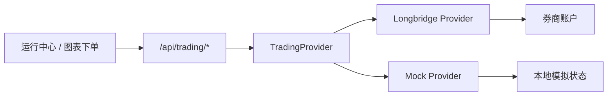
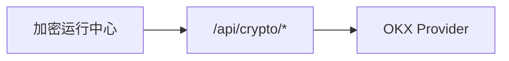

# QuantPilot Broker / Trading 收编设计

> 日期：2026-04-13  
> 范围：将当前已经存在但尚未正式收编的 broker / trading 相关实现纳入主干，形成可测试、可扩展、可继续演进的统一交易主线。

## 1. 背景

当前仓库已经存在一批与交易执行相关的实现，但状态并不统一：

- 后端已有统一交易 API：[trading.py](/Users/bytedance/code/QuantPilot/backend/src/quantpilot/api/trading.py)
- 已有 broker provider 抽象：[provider.py](/Users/bytedance/code/QuantPilot/backend/src/quantpilot/broker/provider.py)
- 已有 `mock / longbridge / okx` provider 雏形
- 前端已有统一交易 API client、store 与交易面板

问题不在于“完全没有”，而在于这些能力仍处于半收编状态：

1. 功能边界还没有被明确固定；
2. `DESIGN.md` 里的券商接入口径仍是旧版本；
3. 当前实现与测试虽然存在，但还没有按正式主线视角收口；
4. 工作区里同时存在大量不属于这条主线的本地脏改动，容易把交易链路再次缠乱。

因此，本轮目标不是发明一套全新交易架构，而是把现有交易能力**收编成正式主线**。

## 2. 目标

本轮要达成的目标只有三个：

1. **统一交易 API 成为正式入口**  
   所有股票/通用交易行为优先走 `/api/trading/*`。

2. **provider 选择逻辑正式固化**  
   使用 `mock / longbridge / auto` 的 provider 选择机制，并明确状态暴露与 fallback 语义。

3. **运行中心建立稳定事实链路**  
   前端交易面板通过统一 trading client + store 访问后端，不再依赖临时接口或散落状态。

## 3. 非目标

本轮不做这些事：

- 不重写全新的 OMS
- 不把股票和加密货币下单模型强行合并
- 不在这一轮做复杂多券商抽象重构
- 不接 Telegram / 告警 / 运维推送
- 不处理与本次主线无关的脏工作区文件

## 4. 推荐方案

### 方案 A：最小收编（推荐）

直接收编现有 trading / broker 实现：

- 统一启用 `/api/trading/*`
- 保留 `TradingProvider` 抽象
- 收紧 `mock / longbridge / auto` 选择逻辑
- 把前端交易页、图表下单入口、store 全部明确挂到统一 trading API
- 用回归测试把订单生命周期、状态接口和 fallback 语义钉住

优点：

- 改动最聚焦
- 与当前代码最贴合
- 能最快形成“真实可继续开发”的交易主线

缺点：

- provider 抽象不是最终形态
- crypto 仍保留独立专用链路

### 方案 B：先重构 provider 再收编

先把股票与加密统一成更抽象的执行域，再接 UI。

优点：

- 长期边界更完整

缺点：

- 范围明显变大
- 容易与当前脏工作区交叉
- 风险高

### 方案 C：只收编股票交易，不动加密

优点：

- 最小范围

缺点：

- 与当前加密运行中心脱节
- 会继续保留两套执行心智

## 5. 最终选择

采用 **方案 A：最小收编**。

原因：

- 它最符合当前仓库已经存在的实现形态；
- 它能最小成本把“半成品交易系统”变成正式主线；
- 它为下一阶段继续补实盘风控、OMS 与 broker 扩展留下空间；
- 它不会把整个系统重新拖进大规模重构。

## 6. 设计边界

### 6.1 后端

后端本轮要正式收编这些模块：

- [trading.py](/Users/bytedance/code/QuantPilot/backend/src/quantpilot/api/trading.py)
- [provider.py](/Users/bytedance/code/QuantPilot/backend/src/quantpilot/broker/provider.py)
- [mock.py](/Users/bytedance/code/QuantPilot/backend/src/quantpilot/broker/mock.py)
- [longbridge.py](/Users/bytedance/code/QuantPilot/backend/src/quantpilot/broker/longbridge.py)
- [types.py](/Users/bytedance/code/QuantPilot/backend/src/quantpilot/broker/types.py)

本轮后端收口要求：

1. `/api/trading/status` 明确返回当前 provider、模式与能力边界
2. `/api/trading/*` 下的订单、持仓、成交、资金流水链路通过回归测试验证
3. `mock` provider 作为本地稳定兜底
4. `longbridge` provider 作为正式股票交易主 provider
5. `auto` 模式在 provider 不可用时回退到 `mock`

### 6.2 前端

前端本轮正式收编：

- [trading.ts](/Users/bytedance/code/QuantPilot/frontend/src/api/trading.ts)
- [tradingStore.ts](/Users/bytedance/code/QuantPilot/frontend/src/store/tradingStore.ts)
- [PaperTradingPanel.tsx](/Users/bytedance/code/QuantPilot/frontend/src/components/PaperTradingPanel.tsx)
- 图表下单入口对统一 trading API 的消费

本轮前端收口要求：

1. 运行中心主交易页继续围绕统一 trading API
2. store 不再依赖临时拼接状态
3. 图表侧下单与交易页读取同一套账户/订单事实

### 6.3 加密链路

本轮不强行合并加密与股票交易接口。

加密继续保留：

- [crypto.py](/Users/bytedance/code/QuantPilot/backend/src/quantpilot/api/crypto.py)
- [okx.py](/Users/bytedance/code/QuantPilot/backend/src/quantpilot/broker/okx.py)

但要求是：

- 不与统一 trading API 冲突
- 不破坏当前工作台中“研究 / 验证 / 运行 / 风险与复盘”的加密工作流

## 7. 数据流

统一交易链路的数据流如下：

加密链路保持独立：

## 8. 错误处理

本轮明确以下错误策略：

1. provider 层异常统一映射为 `TradingProviderError`
2. API 层统一翻译为结构化 HTTP 错误
3. `auto` 模式下，如果 Longbridge 初始化失败，应回退到 `mock` 并在状态接口中显式暴露 fallback 信息
4. UI 只展示用户可理解的错误，不泄露底层异常细节

## 9. 测试策略

本轮测试重点是回归，而不是新建大规模集成环境。

### 9.1 后端

至少保证以下测试：

- 状态接口返回 provider 与能力边界
- 搜索接口支持代码 / 名称
- 订单生命周期主闭环：
  - 账户
  - 报价
  - 估算
  - 下单
  - 成交
  - 持仓
  - 资金流水
- 限价单撤单闭环

### 9.2 前端

至少保证：

- trading client URL 与 contract 正确
- 交易页对统一 trading store 的依赖不回退
- 图表下单入口仍能消费统一 trading API

## 10. 文档同步

本轮需要同步更新：

- [docs/DESIGN.md](/Users/bytedance/code/QuantPilot/docs/DESIGN.md)
- [README.md](/Users/bytedance/code/QuantPilot/README.md)（如果用户可见行为变化需要说明）

并修正设计文档里旧的券商接入口径：

- `Binance API` 不再作为主描述
- 改为以 `Longbridge / OKX / Mock provider` 为当前实际路线

## 11. 成功标准

本轮成功的判断标准是：

1. `/api/trading/*` 成为正式、可测试的统一交易主线
2. `mock / longbridge / auto` provider 行为清晰稳定
3. 运行中心交易页与图表下单都消费同一条 trading 事实链路
4. 加密链路不被破坏
5. 文档口径与代码现实一致

## 12. 风险

### 风险 1：与现有脏工作区交叉

仓库里还有大量不属于本轮的本地改动，容易污染收编边界。

**应对方式**：只修改本轮明确覆盖的 trading / broker / docs / tests 文件。

### 风险 2：过度重构 provider

如果本轮试图顺手统一股票与加密执行层，范围会迅速失控。

**应对方式**：严格保持 crypto 独立链路，不做统一执行域大改。

### 风险 3：把 mock 当成最终方案

mock 是兜底，不是目标。

**应对方式**：状态接口必须显式暴露当前 provider 与 fallback 状态，避免误判为真实券商执行。
