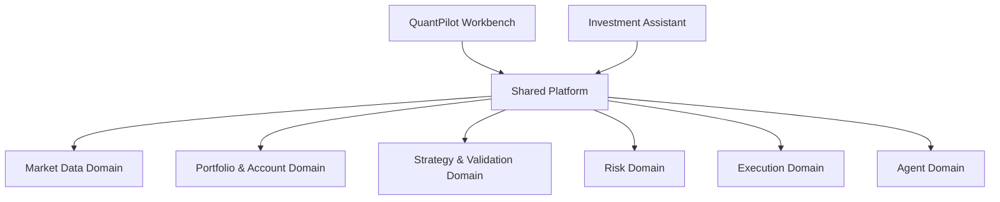

# QuantPilot Dual-Product Re-Architecture Design

> Date: 2026-04-13  
> Scope: Product-level redesign for splitting the current system into a shared platform, a primary quantitative trading workbench, and a separate personal investment assistant.

## 1. Context

QuantPilot has accumulated capabilities across multiple product intentions:

1. a quantitative research and execution workbench,
2. a personal investment assistant,
3. a plugin/ecosystem platform.

These intentions are all individually reasonable, but they optimize for different user outcomes and different product centerlines. The current system therefore risks becoming a feature collection rather than a coherent money-making product.

The desired future state is:

- keep **QuantPilot** as the primary **quantitative trading workbench**,
- build a separate **personal investment assistant** as an independent product,
- move shared facts and shared capabilities into a **common platform layer**,
- keep **LLM/agent capability** in the shared platform rather than as a standalone feature island,
- ensure that both products remain aligned around a single purpose: helping the user make and keep money.

## 2. Problem Statement

The current product shape has five structural problems.

### 2.1 Product identity drift

The system currently mixes workbench flows, assistant flows, and platform/ecosystem ambitions into one surface. This weakens product clarity and causes top-level navigation to represent "what features exist" instead of "how the user makes money."

### 2.2 Workflow dilution

The workbench's real value should come from a clear closed loop:

`research -> strategy -> validation -> run -> risk -> review`

Instead, specialized or adjacent features such as plugin management, social trading, isolated sentiment surfaces, standalone options tooling, and other topic pages compete with the core loop for first-class attention.

### 2.3 LLM role ambiguity

LLM currently behaves like a mix of chat assistant, code generator, explainer, and analyst. This is too loose. The correct long-term position is a shared **agent domain** that consumes platform facts and produces structured suggestions for either product.

### 2.4 Fact fragmentation risk

Without a single source of truth for market data, portfolios, validation state, risk state, and strategy state, the future workbench and assistant could easily produce contradictory outputs.

### 2.5 Roadmap sprawl

When every adjacent capability feels potentially useful, the roadmap drifts toward breadth. This makes the product look sophisticated while weakening the thing users actually pay attention to: whether it helps them generate returns and control downside.

## 3. Product Decision

The approved product direction is:

1. **QuantPilot remains the main product and becomes a tighter quant trading workbench.**
2. **A new independent personal investment assistant product is created.**
3. **Both products share one underlying platform.**
4. **The investment assistant only gives advice and does not directly execute trades in phase one.**
5. **The investment assistant must be able to work independently, even if the user has no self-built strategy stack in QuantPilot.**

## 4. Design Goals

### 4.1 Primary goals

- Restore a single clear product story for QuantPilot.
- Separate "professional quant operations" from "investment decision support."
- Prevent duplicated data, duplicated logic, and duplicated AI reasoning across products.
- Move LLM into a shared, evidence-driven agent layer.
- Rebuild the roadmap around direct profit generation and risk control.

### 4.2 Non-goals

This redesign does not aim to:

- split into two fully independent repositories immediately,
- remove all advanced capabilities from the codebase,
- turn the assistant into an execution product in phase one,
- preserve every current top-level page as first-class UX.

## 5. Recommended Architecture

The recommended architecture is:

This is intentionally not "two apps sharing random utilities." It is a platform-first domain split with two different product layers.

## 6. Shared Platform Domains

The shared platform should own facts and reusable capabilities, not user-facing product identity.

### 6.1 Market Data Domain

Responsibilities:

- market data ingestion,
- historical warehouse,
- standardized symbol/timeframe handling,
- optional alternative data pipelines,
- freshness and provenance tracking.

This domain exists so that both products reason over the same market reality.

### 6.2 Portfolio & Account Domain

Responsibilities:

- account balances,
- positions,
- orders,
- fills,
- cash flow,
- exposure state,
- portfolio snapshots.

This must become the authoritative truth for both products. The assistant must not invent its own portfolio model, and the workbench must not let UI state become account truth.

### 6.3 Strategy & Validation Domain

Responsibilities:

- strategy definitions,
- strategy versions and metadata,
- templates,
- parameter sets,
- backtest runs,
- walk-forward runs,
- validation reports,
- promotion state.

This domain supports the workbench primarily, but the assistant can consume validated strategy outputs as one input into advice.

### 6.4 Risk Domain

Responsibilities:

- single-position risk rules,
- portfolio risk rules,
- drawdown state,
- exposure concentration,
- risk alerts,
- strategy promotion/degradation/retirement state.

The key requirement is that risk is modeled once and exposed everywhere.

### 6.5 Execution Domain

Responsibilities:

- paper trading,
- live trading adapters,
- OMS,
- broker/exchange integrations,
- status reconciliation.

This is consumed primarily by QuantPilot Workbench. The investment assistant may observe execution facts but should not trigger execution in phase one.

### 6.6 Agent Domain

Responsibilities:

- LLM gateway,
- tool orchestration,
- context assembly,
- evidence retrieval,
- suggestion object generation,
- audit logging for AI outputs.

This replaces the idea of "chat page as product center." The agent domain is a capability layer used by both products.

## 7. QuantPilot Workbench Product Definition

QuantPilot should become a focused professional workbench with one central outcome:

> help the user design, validate, operate, and review profitable quantitative strategies.

### 7.1 Core workflow

The workbench should organize around:

`research -> strategy -> validation -> run -> risk/review`

### 7.2 Recommended top-level information architecture

1. **Research**
2. **Strategy Library**
3. **Validation Center**
4. **Run Center**
5. **Risk & Review**

### 7.3 First-class workbench capabilities

- market research and candidate discovery,
- strategy authoring and versioning,
- validation and backtesting,
- parameter experiments,
- paper/live operations,
- portfolio and execution monitoring,
- risk controls and post-run review,
- AI-assisted research and diagnosis.

### 7.4 Capabilities that should stop being first-class navigation

These may still exist, but not as primary product identity:

- plugin marketplace,
- social trading,
- standalone generic AI chat,
- isolated sentiment page,
- isolated ML page,
- isolated chain analytics page,
- standalone options specialty area,
- feature surfaces that do not clearly fit the profit workflow.

### 7.5 Product rule

Any feature that cannot clearly strengthen one of the five workbench steps should not receive first-class placement.

## 8. Investment Assistant Product Definition

The new assistant should be a separate product with one central outcome:

> help the user make better investment decisions, improve expected returns, and reduce avoidable risk.

### 8.1 Core workflow

The assistant should organize around:

`overview -> opportunities -> rebalance suggestions -> risk radar -> review and ask`

### 8.2 Recommended top-level information architecture

1. **Portfolio Overview**
2. **Opportunity Pool**
3. **Rebalance Suggestions**
4. **Risk Radar**
5. **Review & Ask**

### 8.3 Phase-one principles

- It must work even for users who do not have custom strategies in QuantPilot.
- It may consume strategy and validation facts from the shared platform when available.
- It gives recommendations only and does not directly execute trades.
- It must produce structured advice, not only natural-language explanation.

### 8.4 What the assistant should not become

- a second quant workbench,
- a thin wrapper over generic LLM chat,
- an execution surface,
- a container for every finance-related feature that does not fit the workbench.

## 9. Agent Design Principle

LLM should no longer be treated as an isolated page or one-off utility.

The agent domain should do exactly three things:

1. understand user intent,
2. retrieve facts and invoke platform tools,
3. produce structured, evidence-backed suggestions.

### 9.1 Structured suggestion model

All AI recommendations should resolve to explicit typed objects such as:

- `opportunity`
- `rebalance_recommendation`
- `risk_alert`
- `strategy_diagnosis`
- `portfolio_review`

Each suggestion should include:

- `type`
- `subject`
- `recommendation`
- `confidence`
- `evidence`
- `risk_notes`
- `generated_at`
- `freshness`

### 9.2 Rule of evidence

If the agent cannot access sufficient underlying facts, it must degrade to uncertainty rather than fabricate confidence. This is especially important once the assistant becomes a real decision layer.

## 10. Migration of Current Capability Areas

The current system already contains many useful capabilities. The redesign should re-home them rather than treat all of them equally.

### 10.1 Keep first-class in QuantPilot

- market analysis surfaces that directly feed research,
- strategy authoring,
- validation and testing,
- paper/live run management,
- portfolio and risk controls,
- AI strategy diagnosis and research support.

### 10.2 Move into shared platform capability

- LLM chat infrastructure,
- strategy generation engine,
- optimization engine,
- alert engine,
- search and retrieval,
- structured reporting,
- signal and explanation generation.

### 10.3 Move to the assistant layer

- opportunity discovery,
- portfolio explanation,
- allocation and rebalance suggestions,
- market narrative with evidence,
- review summaries and investor-facing Q&A.

### 10.4 Freeze or downgrade

- plugin ecosystem as a product story,
- social/copy-trading,
- knowledge graph as a front-and-center product surface,
- isolated options specialty tool area,
- isolated chain analytics area,
- isolated sentiment/ML topic pages.

These are not necessarily bad capabilities. They are simply not allowed to define the primary product centerline right now.

## 11. Recommended Execution Phases

This redesign is too large for one implementation plan. It should be decomposed into three workstreams with a strict order.

### 11.1 Workstream A: Shared Platform Extraction

Goal:

- formalize domain boundaries,
- establish single-source-of-truth models,
- create shared contracts for data, risk, validation, execution, and agent outputs.

Success criteria:

- both future products can consume the same facts,
- AI outputs are evidence-backed,
- UI state no longer acts as domain truth.

### 11.2 Workstream B: QuantPilot Workbench Tightening

Goal:

- reduce QuantPilot to a clear quant trading workbench,
- rebuild information architecture around profit workflow,
- demote or absorb scattered specialty pages.

Success criteria:

- a first-time user can immediately understand QuantPilot's purpose,
- the primary workflow is visibly strategy-centric,
- the product stops feeling like a finance feature gallery.

### 11.3 Workstream C: Independent Investment Assistant MVP

Goal:

- create an independent advice product,
- provide useful opportunity, risk, allocation, and review guidance even without custom strategies,
- consume shared platform facts when available.

Success criteria:

- assistant advice is structured and evidence-backed,
- assistant value does not depend on direct trade execution,
- assistant meaningfully improves decision clarity.

## 12. Immediate Prioritization

The near-term roadmap should be:

1. freeze further product sprawl,
2. extract and define shared domains,
3. tighten QuantPilot into the workbench,
4. build the investment assistant MVP,
5. only then reconsider advanced expansions.

This ordering follows the current codebase's natural gravity, because the existing system already leans much closer to a workbench than to a polished assistant.

## 13. Success Metrics

The redesign should be evaluated using the following outcomes:

1. **Product clarity**  
   Users can explain the purpose of each product in one sentence.

2. **Profit workflow integrity**  
   QuantPilot clearly supports research-to-operation-to-review without major side-track surfaces competing for center stage.

3. **Fact consistency**  
   Workbench and assistant do not contradict each other on portfolio, strategy, risk, or validation state.

4. **AI credibility**  
   Agent outputs are structured, evidence-backed, and auditable.

5. **Assistant independence**  
   The investment assistant remains useful even for users without custom strategy infrastructure.

## 14. Key Risks

### 14.1 Cosmetic split without true separation

If the products receive different branding but still share muddled product logic, the redesign fails.

### 14.2 Domain boundaries left vague

If the shared platform is not truly authoritative, contradictions and duplication will reappear.

### 14.3 Assistant degenerates into generic chat

If recommendations are not structured and evidence-backed, the assistant becomes a talking interface rather than a money-focused tool.

### 14.4 Workbench re-expands through convenience exceptions

If every interesting capability gets first-class placement again, the current drift will return.

### 14.5 Re-architecture becomes endless

If the team platformizes everything before tightening the workbench, delivery slows and product value gets delayed.

## 15. Final Recommendation

Proceed with:

- **one shared platform**,  
- **QuantPilot as the primary quant workbench**,  
- **one separate personal investment assistant**,  
- **LLM as a shared agent layer**,  
- **a roadmap governed only by profit generation, loss reduction, or the platform capabilities required to support those two goals**.

This is the cleanest path to restoring product focus without discarding valuable existing work.
