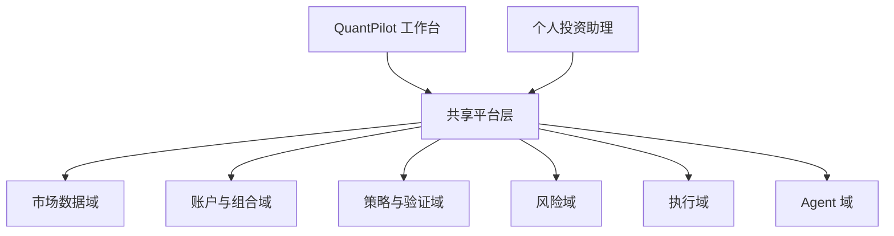

# QuantPilot 双产品重构设计

> 日期：2026-04-13  
> 范围：将当前系统重构为“共享底层平台 + 主产品 QuantPilot 量化交易工作台 + 独立个人投资助理”的产品级设计方案。

## 1. 背景

当前 QuantPilot 已经同时承载了多种产品意图：

1. 量化研究与执行工作台；
2. 个人投资助理；
3. 平台/生态型扩展系统。

这些方向单独看都成立，但它们追求的用户结果不同、信息架构不同、主线工作流也不同。继续把它们放在一个同等优先级的产品里，会让系统越来越像“功能集合”，而不是一个围绕赚钱目标收敛的产品。

期望的未来状态是：

- 保留 **QuantPilot**，并将其收紧为主产品 **量化交易工作台**；
- 新建一个独立的 **个人投资助理** 产品；
- 将共享事实与共享能力下沉到 **统一平台层**；
- 将 **LLM/Agent 能力** 从页面功能改为共享底层能力；
- 让两个产品始终围绕同一宗旨：**帮助用户赚钱，并帮助用户少亏钱。**

## 2. 问题定义

当前系统存在五个结构性问题。

### 2.1 产品身份漂移

系统同时混合了工作台流、助理流和平台生态流，导致产品很难一句话说清楚。顶层导航表达的是“系统里有什么功能”，而不是“用户如何通过它赚钱”。

### 2.2 主线工作流被稀释

量化工作台真正应该围绕的闭环是：

`研究 -> 策略 -> 验证 -> 运行 -> 风险 -> 复盘`

但现在很多专题页、边缘能力和扩展方向占据了一等心智，使主线看起来不再是赚钱闭环，而像一个量化能力展厅。

### 2.3 LLM 角色模糊

当前 LLM 同时像聊天助手、代码生成器、解释器和分析器。这样会让它变成“哪里都能插一点”的功能，而不是有明确职责的能力层。长期正确位置应是共享 **Agent Domain**：消费平台事实，输出结构化建议，服务两个上层产品。

### 2.4 事实来源分裂风险

如果市场数据、持仓状态、验证状态、风险状态、策略状态不能统一，未来工作台与投资助理很容易给出相互矛盾的结果，直接损害产品可信度。

### 2.5 Roadmap 发散

当每一个相邻功能看起来都“可能有价值”时，路线图就会向广度扩张。结果是产品越来越复杂，但真正帮助用户赚钱和控制风险的主线反而更模糊。

## 3. 已确认的产品决策

本次重构方向已经明确如下：

1. **QuantPilot 保留为主产品，并收紧为量化交易工作台。**
2. **新建一个独立的个人投资助理产品。**
3. **两个产品共享同一个底层平台。**
4. **个人投资助理在第一阶段只做建议，不直接执行交易。**
5. **个人投资助理必须能够独立工作，即使用户没有在 QuantPilot 中维护自建策略。**

## 4. 设计目标

### 4.1 主要目标

- 恢复 QuantPilot 清晰、单一的产品定位；
- 将“专业量化操作”和“投资决策辅助”彻底分层；
- 避免两个产品重复建设数据、逻辑和 AI 能力；
- 将 LLM 下沉为共享、证据驱动的 Agent 层；
- 让路线图重新围绕“提高赚钱能力”和“降低亏钱风险”排序。

### 4.2 非目标

本次设计不追求：

- 立刻拆成两个完全独立仓库；
- 把所有高级能力从代码里删掉；
- 让投资助理在第一阶段就直接执行交易；
- 保留现有所有顶层页面为一等入口。

## 5. 推荐总体架构

推荐架构如下：

这不是“两个应用共用一些工具函数”，而是一个明确的 **平台优先、产品分层** 架构。

## 6. 共享平台域设计

共享平台只负责事实与能力，不负责产品叙事。

### 6.1 市场数据域（Market Data Domain）

职责包括：

- 行情采集；
- 历史仓库；
- symbol / timeframe 标准化；
- 另类数据接入能力；
- 数据新鲜度与来源追踪。

这个域的意义在于：两个产品必须基于同一套市场事实做判断。

### 6.2 账户与组合域（Portfolio & Account Domain）

职责包括：

- 账户余额；
- 持仓；
- 订单；
- 成交；
- 现金流；
- 风险敞口；
- 组合快照。

这一层必须成为绝对权威来源。投资助理不能自己再造一套持仓模型，工作台也不能把前端状态当作账户事实。

### 6.3 策略与验证域（Strategy & Validation Domain）

职责包括：

- 策略定义；
- 策略版本与元数据；
- 模板；
- 参数集；
- 回测记录；
- Walk-Forward 记录；
- 验证报告；
- 晋升/降级/退役状态。

这个域主要支撑工作台，但投资助理可以在有相关数据时消费验证结果，作为建议输入之一。

### 6.4 风险域（Risk Domain）

职责包括：

- 单笔风险规则；
- 组合层风险规则；
- 回撤状态；
- 集中度状态；
- 风险告警；
- 策略熔断、晋升、降权、退役规则状态。

关键原则是：**风险只建模一次，到处复用。**

### 6.5 执行域（Execution Domain）

职责包括：

- 模拟盘；
- 实盘适配器；
- OMS；
- 券商/交易所适配；
- 状态同步与对账。

这一层主要由 QuantPilot 工作台消费。投资助理可以观察执行事实，但在第一阶段不能触发执行。

### 6.6 Agent 域（Agent Domain）

职责包括：

- LLM Gateway；
- 工具编排；
- 上下文拼装；
- 证据检索；
- 建议对象生成；
- AI 输出审计日志。

这会替代“聊天页就是 AI 产品中心”的做法。Agent 域是一层共享能力，不是一个孤立页面。

## 7. QuantPilot 工作台定义

QuantPilot 应该收紧为一个专业工作台，其唯一核心目标是：

> 帮助用户更高效地设计、验证、运行和复盘能赚钱的量化策略。

### 7.1 核心工作流

工作台主线固定为：

`研究 -> 策略 -> 验证 -> 运行 -> 风险/复盘`

### 7.2 推荐顶层信息架构

1. **研究中心**
2. **策略库**
3. **验证中心**
4. **运行中心**
5. **风险与复盘**

### 7.3 应保留为一等能力的内容

- 市场研究与候选标的发现；
- 策略编写、管理、版本控制；
- 回测、样本外验证、参数实验；
- 模拟盘与实盘运行；
- 订单、持仓、执行质量与组合监控；
- 风控、熔断、复盘；
- AI/Agent 驱动的研究辅助与策略诊断。

### 7.4 不应继续作为一等导航的能力

以下内容可以保留，但不应再成为主产品身份的一部分：

- 插件市场；
- 社交跟单；
- 独立通用 AI 聊天页；
- 独立情绪页；
- 独立 ML 页；
- 独立链上专题页；
- 独立期权专业工具区；
- 与赚钱闭环关联不清晰的专题能力。

### 7.5 产品准入规则

以后任何新功能，如果不能直接增强工作台五步主线中的某一步，就不应进入一等入口。

## 8. 个人投资助理定义

个人投资助理应当是一个独立产品，其唯一核心目标是：

> 帮助用户做出更好的投资决策，提高预期收益，并降低可避免的风险。

### 8.1 核心决策流

投资助理主线固定为：

`总览 -> 机会池 -> 调仓建议 -> 风险雷达 -> 复盘与问答`

### 8.2 推荐顶层信息架构

1. **资产总览**
2. **机会池**
3. **调仓建议**
4. **风险雷达**
5. **复盘与问答**

### 8.3 第一阶段原则

- 即使用户没有在 QuantPilot 中维护任何策略，也必须能提供价值；
- 如果用户接入了工作台中的策略与组合数据，建议质量应进一步提升；
- 只做建议，不做直接下单；
- 必须输出结构化建议，而不是只有自然语言解释。

### 8.4 不应变成什么

个人投资助理不应该变成：

- 第二个量化工作台；
- 一个泛聊天机器人；
- 一个执行面板；
- 一个承接所有边缘金融功能的收纳箱。

## 9. Agent 设计原则

LLM 不应再被视为某个单独页面，而应成为底层 Agent 能力。

Agent 域只做三件事：

1. 理解用户意图；
2. 拉取事实、调用平台工具；
3. 生成结构化、带证据的建议。

### 9.1 建议对象必须结构化

所有 AI 建议都应落成明确类型，例如：

- `opportunity`
- `rebalance_recommendation`
- `risk_alert`
- `strategy_diagnosis`
- `portfolio_review`

每条建议至少应包含：

- `type`
- `subject`
- `recommendation`
- `confidence`
- `evidence`
- `risk_notes`
- `generated_at`
- `freshness`

### 9.2 证据优先原则

如果 Agent 无法拿到足够事实，就必须降级为“不确定”或“无法判断”，而不是继续装作很有把握。这对投资助理尤其重要。

## 10. 现有能力的归位建议

当前仓库里已有很多能力，不应一刀切删除，而应重新归位。

### 10.1 保留为 QuantPilot 一等能力

- 直接服务研究的市场分析能力；
- 策略编写与策略资产管理；
- 回测、验证、实验；
- 模拟盘、实盘、组合运行；
- 风控与复盘；
- AI 驱动的研究与诊断。

### 10.2 下沉为共享平台能力

- LLM 聊天基础设施；
- 策略生成；
- 参数优化；
- 告警引擎；
- 搜索与检索；
- 报告生成；
- 信号生成与解释能力。

### 10.3 上移到投资助理层

- 机会发现；
- 持仓解释；
- 资产配置建议；
- 调仓建议；
- 风险提示；
- 周/月复盘；
- 面向投资者的问答与解释。

### 10.4 冻结或降级

- 插件生态作为产品主线；
- 社交/跟单；
- 知识图谱作为核心展示能力；
- 独立期权工具区；
- 独立链上专题页；
- 独立情绪 / ML 专题页。

这些能力不一定没有价值，但当前阶段不应再定义产品主线。

## 11. 推荐实施阶段

这次重构过大，不能写成一份“一口吃完”的实现计划。应拆成三个 workstream，且有明确顺序。

### 11.1 Workstream A：共享平台抽取

目标：

- 明确 domain 边界；
- 建立统一事实模型；
- 为数据、风险、验证、执行、Agent 输出定义共享契约。

成功标准：

- 两个上层产品可以消费同一套事实；
- AI 输出都能追溯证据；
- UI 状态不再充当系统真相。

### 11.2 Workstream B：QuantPilot 工作台收紧

目标：

- 将 QuantPilot 收紧为“量化交易工作台”；
- 按赚钱工作流重做信息架构；
- 将主题页、专题页、边缘功能降级或吸收。

成功标准：

- 新用户一打开就能理解 QuantPilot 是做什么的；
- 主流程明显以策略研发、验证、运行为中心；
- 产品不再像金融功能大杂烩。

### 11.3 Workstream C：独立投资助理 MVP

目标：

- 新建独立投资助理产品；
- 即使用户没有自建策略，也能给出机会、配置、风险和复盘建议；
- 在有共享平台事实时，建议能进一步增强。

成功标准：

- 助理建议结构化、可解释、可追溯；
- 不依赖直接交易执行也能体现价值；
- 明显提升决策清晰度。

## 12. 近期优先级顺序

近期路线建议固定为：

1. 冻结继续发散的新功能；
2. 抽共享平台域；
3. 收紧 QuantPilot 工作台；
4. 搭建独立投资助理 MVP；
5. 最后再评估高级扩展能力是否值得回归。

这个顺序是顺着现有代码重心走的，因为当前系统天然更接近工作台，而不是一个成熟的投资助理。

## 13. 成功衡量标准

本次重构应通过以下结果判断是否成功：

1. **产品定位清晰**  
   用户能用一句话说清 QuantPilot 是什么、投资助理是什么。

2. **赚钱主线完整**  
   QuantPilot 清晰支撑“研究 -> 策略 -> 验证 -> 运行 -> 风险/复盘”，且不被边缘页面打断。

3. **事实一致**  
   工作台与投资助理不会在持仓、风险、验证状态、策略状态上互相矛盾。

4. **AI 可信**  
   Agent 输出结构化、带证据、可审计。

5. **助理可独立成立**  
   即使用户没有自建策略，也能从投资助理获得明确价值。

## 14. 主要风险

### 14.1 只拆名字，不拆产品灵魂

如果最后只是做了两个名字不同的壳，但产品逻辑仍旧混在一起，那么这次重构就是失败的。

### 14.2 平台域边界没有真正抽清

如果共享平台不是权威事实来源，两个产品很快又会出现重复建设和互相打架。

### 14.3 投资助理退化成泛聊天

如果没有结构化建议和证据绑定，助理会沦为“很会说话但不真正赚钱”的 AI 包装层。

### 14.4 工作台重新膨胀

如果后续又继续把所有“看起来有点用”的能力塞回一等导航，产品漂移会再次出现。

### 14.5 重构周期失控

如果一开始就试图完成彻底平台化，容易陷入长期重构而没有用户价值交付。

## 15. 最终建议

建议坚定执行以下方向：

- **一个共享底层平台**；
- **QuantPilot 作为主产品量化工作台**；
- **一个独立的个人投资助理产品**；
- **LLM 作为共享 Agent 层**；
- **未来所有路线图，只允许围绕“提升赚钱能力”“降低亏钱风险”或“支撑这两者的底层能力”来排序。**

这是在不浪费现有成果的前提下，让产品重新聚焦、重新变得可信、也重新回到赚钱主线的最干净路径。
